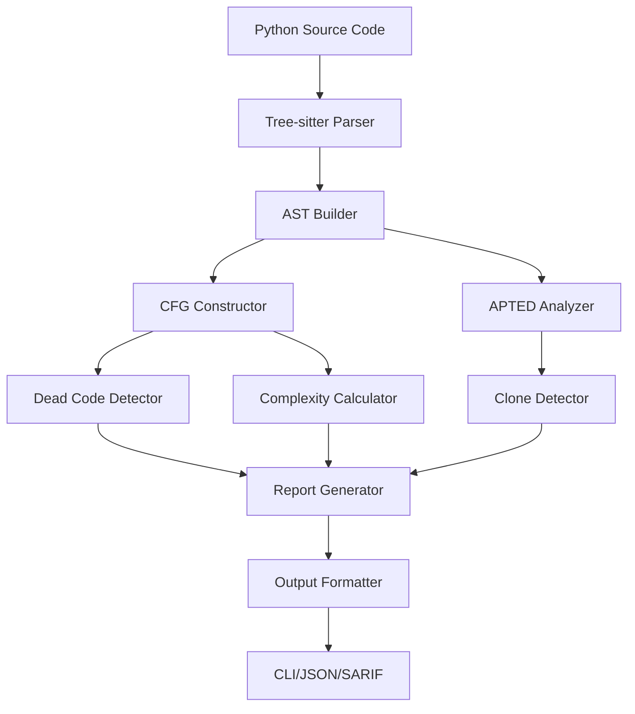

# Architecture Overview

## System Design

pyqol is designed as a modular, high-performance static analysis tool for Python code. The architecture follows a pipeline approach where code flows through multiple analysis stages.



## Core Components

### 1. Parser Module (`internal/parser`)

The parser module handles Python code parsing using tree-sitter.

```go
// internal/parser/parser.go
type Parser struct {
    language *sitter.Language
    parser   *sitter.Parser
}

type Node struct {
    Type     NodeType
    Value    string
    Children []*Node
    Location Location
}

type Location struct {
    File  string
    Line  int
    Col   int
}
```

**Responsibilities:**
- Parse Python source files
- Build internal AST representation
- Handle syntax errors gracefully
- Support Python 3.8+ syntax

**Key Files:**
- `parser.go`: Main parser implementation
- `python.go`: Python-specific parsing logic
- `ast.go`: AST node definitions
- `visitor.go`: AST visitor pattern implementation

### 2. Analyzer Module (`internal/analyzer`)

The analyzer module contains the core analysis algorithms.

#### 2.1 Control Flow Graph (CFG)

```go
// internal/analyzer/cfg.go
type CFG struct {
    Entry  *BasicBlock
    Exit   *BasicBlock
    Blocks map[string]*BasicBlock
}

type BasicBlock struct {
    ID          string
    Statements  []ast.Node
    Successors  []*BasicBlock
    Predecessors []*BasicBlock
}

type CFGBuilder struct {
    current *BasicBlock
    cfg     *CFG
    loops   []LoopContext
    breaks  []BreakContext
}
```

**Algorithm:**
1. Create entry and exit blocks
2. Process statements sequentially
3. Handle control flow statements:
   - `if/elif/else`: Create branches
   - `for/while`: Create loop structures
   - `break/continue`: Update loop edges
   - `return`: Connect to exit block
   - `try/except`: Handle exception flow

#### 2.2 Dead Code Detection

```go
// internal/analyzer/dead.go
type DeadCodeDetector struct {
    cfg      *CFG
    reached  map[string]bool
    liveVars map[string]VarInfo
}

type Finding struct {
    Type     FindingType
    Location Location
    Message  string
    Severity Severity
}
```

**Algorithm:**
1. Mark entry block as reachable
2. Perform breadth-first traversal
3. Mark all visited blocks as reachable
4. Report unreachable blocks as dead code
5. Analyze variable usage for unused detection

#### 2.3 APTED Clone Detection

```go
// internal/analyzer/apted.go
type APTEDAnalyzer struct {
    threshold float64
    costModel CostModel
}

type TreeNode struct {
    Label    string
    Children []*TreeNode
    Parent   *TreeNode
    ID       int
}

type CostModel interface {
    Insert(node *TreeNode) float64
    Delete(node *TreeNode) float64
    Rename(node1, node2 *TreeNode) float64
}
```

**Algorithm (APTED - All Path Tree Edit Distance):**
1. Convert AST subtrees to ordered trees
2. Compute optimal tree edit distance
3. Use dynamic programming with path decomposition
4. Compare distance against threshold
5. Group similar code blocks as clones

### 3. Configuration Module (`internal/config`)

```go
// internal/config/config.go
type Config struct {
    // Analysis settings
    DeadCode      DeadCodeConfig      `yaml:"dead_code"`
    CloneDetection CloneDetectionConfig `yaml:"clone_detection"`
    Complexity    ComplexityConfig    `yaml:"complexity"`
    
    // Output settings
    Output        OutputConfig        `yaml:"output"`
    
    // File patterns
    Include       []string            `yaml:"include"`
    Exclude       []string            `yaml:"exclude"`
}

type DeadCodeConfig struct {
    Enabled            bool `yaml:"enabled"`
    CheckUnusedImports bool `yaml:"check_unused_imports"`
    CheckUnusedVars    bool `yaml:"check_unused_vars"`
}

type CloneDetectionConfig struct {
    Enabled           bool    `yaml:"enabled"`
    MinLines          int     `yaml:"min_lines"`
    SimilarityThreshold float64 `yaml:"similarity_threshold"`
}
```

### 4. CLI Module (`cmd/pyqol`)

```go
// cmd/pyqol/main.go
type CLI struct {
    rootCmd *cobra.Command
    config  *config.Config
}

// Commands:
// - analyze: Run full analysis
// - check: Quick dead code check
// - clone: Find code clones
// - complexity: Calculate complexity metrics
```

## Data Flow

### 1. Input Processing

```
Source File → Read → Tokenize → Parse → AST
```

### 2. Analysis Pipeline

```
AST → CFG Construction → Dead Code Analysis → Results
    ↘                                      ↗
      APTED Analysis → Clone Detection → 
```

### 3. Output Generation

```
Results → Aggregation → Formatting → Output (CLI/JSON/SARIF)
```

## Performance Optimizations

### 1. Parallel Processing

- Parse multiple files concurrently
- Run independent analyses in parallel
- Use worker pools for large codebases

```go
type WorkerPool struct {
    workers   int
    jobs      chan Job
    results   chan Result
    waitGroup sync.WaitGroup
}
```

### 2. Memory Management

- Stream large files instead of loading entirely
- Reuse AST nodes where possible
- Clear unused CFG blocks after analysis
- Use object pools for frequent allocations

### 3. Caching

- Cache parsed ASTs for unchanged files
- Store CFGs for incremental analysis
- Memoize APTED distance calculations

```go
type Cache struct {
    ast  map[string]*AST      // File hash → AST
    cfg  map[string]*CFG      // Function → CFG
    dist map[string]float64   // Node pair → distance
}
```

## Error Handling

### Error Types

```go
type ErrorType int

const (
    ParseError ErrorType = iota
    AnalysisError
    ConfigError
    IOError
)

type Error struct {
    Type     ErrorType
    Message  string
    Location *Location
    Cause    error
}
```

### Recovery Strategies

1. **Parse Errors**: Skip problematic file, continue with others
2. **Analysis Errors**: Report partial results, mark incomplete
3. **Config Errors**: Use defaults, warn user
4. **IO Errors**: Retry with backoff, then fail gracefully

## Extension Points

### 1. Custom Analyzers

```go
type Analyzer interface {
    Name() string
    Analyze(ast *AST) ([]Finding, error)
    Configure(config map[string]interface{}) error
}
```

### 2. Output Formatters

```go
type Formatter interface {
    Format(findings []Finding) ([]byte, error)
    Extension() string
    ContentType() string
}
```

### 3. Language Support

```go
type Language interface {
    Name() string
    Parse(source []byte) (*AST, error)
    GetGrammar() *sitter.Language
}
```

## Testing Strategy

### 1. Unit Tests

- Test each component in isolation
- Mock dependencies
- Use table-driven tests
- Achieve >80% coverage

### 2. Integration Tests

- Test component interactions
- Use real Python code samples
- Verify end-to-end flow
- Test error scenarios

### 3. Performance Tests

- Benchmark critical paths
- Test with large codebases
- Monitor memory usage
- Profile CPU usage

### 4. Test Data

```
testdata/
├── python/
│   ├── simple/       # Basic Python constructs
│   ├── complex/      # Complex code patterns
│   ├── edge_cases/   # Edge cases and errors
│   └── benchmarks/   # Performance test files
└── golden/           # Expected output files
```

## Security Considerations

### 1. Input Validation

- Validate file paths
- Limit file sizes
- Sanitize configuration
- Check for path traversal

### 2. Resource Limits

- Cap memory usage
- Limit goroutines
- Timeout long operations
- Prevent infinite loops

### 3. Safe Parsing

- Handle malformed code
- Prevent parser exploits
- Validate AST depth
- Limit recursion

## Future Enhancements

### Phase 1 (Current MVP)
- [x] Tree-sitter integration
- [x] CFG construction
- [x] Dead code detection
- [x] APTED implementation
- [x] Basic CLI

### Phase 2 (v0.2)
- [ ] Incremental analysis
- [ ] VS Code extension
- [ ] Import dependency analysis
- [ ] Type inference integration

### Phase 3 (v0.3)
- [ ] LLM-powered suggestions
- [ ] Auto-fix capabilities
- [ ] Multi-language support
- [ ] Cloud analysis service

## Dependencies

### Core Dependencies

```go
// go.mod
require (
    github.com/smacker/go-tree-sitter v0.0.0-20230720070738-0d0a9f78d8f8
    github.com/spf13/cobra v1.8.0
    github.com/spf13/viper v1.18.2
    gopkg.in/yaml.v3 v3.0.1
)
```

### Development Dependencies

```go
require (
    github.com/stretchr/testify v1.8.4
    github.com/golangci/golangci-lint v1.55.2
    golang.org/x/tools v0.17.0
)
```

## Configuration Examples

### Basic Configuration

```yaml
# .pyqol.yaml
dead_code:
  enabled: true
  check_unused_imports: true
  check_unused_vars: true

clone_detection:
  enabled: true
  min_lines: 5
  similarity_threshold: 0.8

output:
  format: text
  verbose: false

exclude:
  - "**/*_test.py"
  - "**/migrations/**"
```

### Advanced Configuration

```yaml
# .pyqol.yaml
dead_code:
  enabled: true
  check_unused_imports: true
  check_unused_vars: true
  ignore_patterns:
    - "__all__"
    - "_*"

clone_detection:
  enabled: true
  min_lines: 10
  similarity_threshold: 0.7
  ignore_literals: true
  ignore_identifiers: false

complexity:
  enabled: true
  max_complexity: 10
  warn_complexity: 7

output:
  format: json
  file: "pyqol-report.json"
  verbose: true
  include_source: true

include:
  - "src/**/*.py"
  - "lib/**/*.py"

exclude:
  - "**/*_test.py"
  - "**/test_*.py"
  - "**/migrations/**"
  - "**/__pycache__/**"
```

## Metrics and Monitoring

### Analysis Metrics

- Files analyzed
- Lines processed
- Findings detected
- Analysis duration
- Memory peak usage

### Quality Metrics

- False positive rate
- Detection accuracy
- Performance benchmarks
- User satisfaction

### Telemetry (Optional)

```go
type Telemetry struct {
    Version   string
    OS        string
    Arch      string
    FileCount int
    LineCount int
    Duration  time.Duration
    Findings  map[string]int
}
```

## Conclusion

This architecture provides a solid foundation for a high-performance Python static analysis tool. The modular design allows for easy extension and maintenance, while the performance optimizations ensure scalability to large codebases.