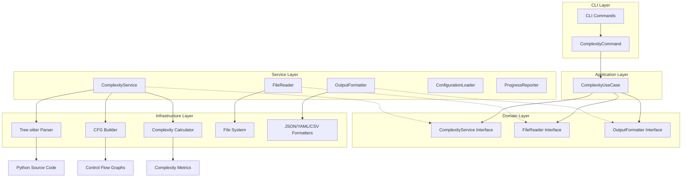

# Architecture Overview

## System Design

pyscn follows **Clean Architecture** principles with clear separation of concerns and dependency inversion. The system is designed as a modular, high-performance static analysis tool for Python code.



## Clean Architecture Layers

### 1. **Domain Layer** (`domain/`)

The innermost layer containing business rules and entities. No dependencies on external frameworks.

```go
// domain/complexity.go
type ComplexityService interface {
    Analyze(ctx context.Context, req ComplexityRequest) (ComplexityResponse, error)
    AnalyzeFile(ctx context.Context, filePath string, req ComplexityRequest) (ComplexityResponse, error)
}

type FileReader interface {
    CollectPythonFiles(paths []string, recursive bool, include, exclude []string) ([]string, error)
    IsValidPythonFile(path string) bool
}

type OutputFormatter interface {
    Write(response ComplexityResponse, format OutputFormat, writer io.Writer) error
}

type ComplexityRequest struct {
    Paths            []string
    OutputFormat     OutputFormat
    OutputWriter     io.Writer
    MinComplexity    int
    MaxComplexity    int
    SortBy          SortCriteria
    LowThreshold    int
    MediumThreshold int
    ShowDetails     bool
    Recursive       bool
    IncludePatterns []string
    ExcludePatterns []string
    ConfigPath      string
}
```

### 2. **Application Layer** (`app/`)

Orchestrates business logic and coordinates between domain services.

```go
// app/complexity_usecase.go
type ComplexityUseCase struct {
    service       domain.ComplexityService
    fileReader    domain.FileReader
    formatter     domain.OutputFormatter
    configLoader  domain.ConfigurationLoader
    progress      domain.ProgressReporter
}

func (uc *ComplexityUseCase) Execute(ctx context.Context, req domain.ComplexityRequest) error {
    // 1. Validate input
    // 2. Load configuration
    // 3. Collect Python files
    // 4. Perform analysis
    // 5. Format and output results
}
```

### 3. **Service Layer** (`service/`)

Implements domain interfaces with concrete business logic.

```go
// service/complexity_service.go
type ComplexityService struct {
    progress domain.ProgressReporter
}

func (s *ComplexityService) Analyze(ctx context.Context, req domain.ComplexityRequest) (domain.ComplexityResponse, error) {
    // Implements the complexity analysis workflow
}
```

### 4. **CLI Layer** (`cmd/pyscn/`)

Thin adapter layer that handles user input and delegates to application layer.

```go
// cmd/pyscn/complexity_clean.go
type ComplexityCommand struct {
    outputFormat    string
    minComplexity   int
    maxComplexity   int
    // ... other CLI flags
}

func (c *ComplexityCommand) runComplexityAnalysis(cmd *cobra.Command, args []string) error {
    // 1. Parse CLI flags into domain request
    // 2. Create use case with dependencies
    // 3. Execute use case
    // 4. Handle errors appropriately
}
```

## Core Components

### 1. Parser Module (`internal/parser`)

The parser module handles Python code parsing using tree-sitter.

```go
// internal/parser/parser.go
type Parser struct {
    language *sitter.Language
    parser   *sitter.Parser
}

type Node struct {
    Type     NodeType
    Value    string
    Children []*Node
    Location Location
}

type Location struct {
    File  string
    Line  int
    Col   int
}
```

**Responsibilities:**
- Parse Python source files
- Build internal AST representation
- Handle syntax errors gracefully
- Support Python 3.8+ syntax

**Key Files:**
- `parser.go`: Main parser implementation
- `python.go`: Python-specific parsing logic
- `ast.go`: AST node definitions
- `visitor.go`: AST visitor pattern implementation

### 2. Analyzer Module (`internal/analyzer`)

The analyzer module contains the core analysis algorithms.

#### 2.1 Control Flow Graph (CFG)

```go
// internal/analyzer/cfg.go
type CFG struct {
    Entry  *BasicBlock
    Exit   *BasicBlock
    Blocks map[string]*BasicBlock
}

type BasicBlock struct {
    ID          string
    Statements  []ast.Node
    Successors  []*BasicBlock
    Predecessors []*BasicBlock
}

type CFGBuilder struct {
    current *BasicBlock
    cfg     *CFG
    loops   []LoopContext
    breaks  []BreakContext
}
```

**Algorithm:**
1. Create entry and exit blocks
2. Process statements sequentially
3. Handle control flow statements:
   - `if/elif/else`: Create branches
   - `for/while`: Create loop structures
   - `break/continue`: Update loop edges
   - `return`: Connect to exit block
   - `try/except`: Handle exception flow

#### 2.2 Dead Code Detection

```go
// internal/analyzer/dead.go
type DeadCodeDetector struct {
    cfg      *CFG
    reached  map[string]bool
    liveVars map[string]VarInfo
}

type Finding struct {
    Type     FindingType
    Location Location
    Message  string
    Severity Severity
}
```

**Algorithm:**
1. Mark entry block as reachable
2. Perform breadth-first traversal
3. Mark all visited blocks as reachable
4. Report unreachable blocks as dead code
5. Analyze variable usage for unused detection

#### 2.3 APTED Clone Detection

```go
// internal/analyzer/apted.go
type APTEDAnalyzer struct {
    threshold float64
    costModel CostModel
}

type TreeNode struct {
    Label    string
    Children []*TreeNode
    Parent   *TreeNode
    ID       int
}

type CostModel interface {
    Insert(node *TreeNode) float64
    Delete(node *TreeNode) float64
    Rename(node1, node2 *TreeNode) float64
}
```

**Algorithm (APTED - All Path Tree Edit Distance):**
1. Convert AST subtrees to ordered trees
2. Compute optimal tree edit distance
3. Use dynamic programming with path decomposition
4. Compare distance against threshold
5. Group similar code blocks as clones

### 3. Configuration Module (`internal/config`)

The configuration system implements Ruff-style hierarchical configuration discovery with support for multiple formats and locations.

```go
// internal/config/config.go
type Config struct {
    // Analysis settings
    DeadCode      DeadCodeConfig      `yaml:"dead_code"`
    CloneDetection CloneDetectionConfig `yaml:"clone_detection"`
    Complexity    ComplexityConfig    `yaml:"complexity"`
    
    // Output settings
    Output        OutputConfig        `yaml:"output"`
    
    // File patterns
    Include       []string            `yaml:"include"`
    Exclude       []string            `yaml:"exclude"`
}

type OutputConfig struct {
    Format        string `yaml:"format"`
    Directory     string `yaml:"directory"`    // Output directory for reports
    Verbose       bool   `yaml:"verbose"`
    ShowDetails   bool   `yaml:"show_details"`
    SortBy        string `yaml:"sort_by"`
    MinComplexity int    `yaml:"min_complexity"`
}

type DeadCodeConfig struct {
    Enabled            bool `yaml:"enabled"`
    CheckUnusedImports bool `yaml:"check_unused_imports"`
    CheckUnusedVars    bool `yaml:"check_unused_vars"`
}

type CloneDetectionConfig struct {
    Enabled           bool    `yaml:"enabled"`
    MinLines          int     `yaml:"min_lines"`
    SimilarityThreshold float64 `yaml:"similarity_threshold"`
}
```

#### Configuration Discovery Algorithm

pyscn uses a hierarchical configuration discovery system inspired by Ruff and other modern tools:

```go
// LoadConfigWithTarget searches for configuration in this order:
func LoadConfigWithTarget(configPath string, targetPath string) (*Config, error) {
    // 1. Explicit config path (highest priority)
    if configPath != "" {
        return loadFromFile(configPath)
    }
    
    // 2. Search from target directory upward
    if targetPath != "" {
        if config := searchUpward(targetPath); config != "" {
            return loadFromFile(config)
        }
    }
    
    // 3. Current directory
    if config := findInDirectory("."); config != "" {
        return loadFromFile(config)
    }
    
    // 4. XDG config directory
    if config := findInXDGConfig(); config != "" {
        return loadFromFile(config)
    }
    
    // 5. Home directory (fallback)
    if config := findInHomeDir(); config != "" {
        return loadFromFile(config)
    }
    
    // 6. Default configuration
    return DefaultConfig(), nil
}
```

**Configuration File Priority:**
1. `pyscn.yaml`
2. `pyscn.yml` 
3. `.pyscn.yaml`
4. `.pyscn.yml`
5. `pyscn.json`
6. `.pyscn.json`

**Search Locations (in order):**
1. **Target Directory & Parents**: Starting from the analysis target, search upward to filesystem root
2. **XDG Config**: `$XDG_CONFIG_HOME/pyscn/` or `~/.config/pyscn/`
3. **Home Directory**: `~/.pyscn.yaml` (backward compatibility)

### 4. CLI Module (`cmd/pyscn`)

The CLI layer uses the Command pattern with Cobra framework.

```go
// cmd/pyscn/main.go - Root command setup
type CLI struct {
    rootCmd *cobra.Command
}

// cmd/pyscn/complexity_clean.go - Command implementation
type ComplexityCommand struct {
    outputFormat    string
    minComplexity   int
    maxComplexity   int
    sortBy          string
    showDetails     bool
    configFile      string
    lowThreshold    int
    mediumThreshold int
    verbose         bool
}

// Current Commands:
// - complexity: Calculate McCabe cyclomatic complexity
// Future Commands:
// - dead-code: Find unreachable code
// - clone: Detect code clones using APTED
// - analyze: Run comprehensive analysis
```

## Dependency Injection & Builder Pattern

The system uses dependency injection to achieve loose coupling and testability.

```go
// app/complexity_usecase.go - Builder pattern for complex object creation
type ComplexityUseCaseBuilder struct {
    service      domain.ComplexityService
    fileReader   domain.FileReader
    formatter    domain.OutputFormatter
    configLoader domain.ConfigurationLoader
    progress     domain.ProgressReporter
}

func NewComplexityUseCaseBuilder() *ComplexityUseCaseBuilder
func (b *ComplexityUseCaseBuilder) WithService(service domain.ComplexityService) *ComplexityUseCaseBuilder
func (b *ComplexityUseCaseBuilder) WithFileReader(fileReader domain.FileReader) *ComplexityUseCaseBuilder
func (b *ComplexityUseCaseBuilder) Build() (*ComplexityUseCase, error)

// cmd/pyscn/complexity_clean.go - Dependency assembly
func (c *ComplexityCommand) createComplexityUseCase(cmd *cobra.Command) (*app.ComplexityUseCase, error) {
    // Create services
    fileReader := service.NewFileReader()
    formatter := service.NewOutputFormatter()
    configLoader := service.NewConfigurationLoader()
    progress := service.CreateProgressReporter(cmd.ErrOrStderr(), 0, c.verbose)
    complexityService := service.NewComplexityService(progress)

    // Build use case with dependencies
    return app.NewComplexityUseCaseBuilder().
        WithService(complexityService).
        WithFileReader(fileReader).
        WithFormatter(formatter).
        WithConfigLoader(configLoader).
        WithProgress(progress).
        Build()
}
```

## Data Flow

### 1. Input Processing

```
Source File → Read → Tokenize → Parse → AST
```

### 2. Analysis Pipeline

```
AST → CFG Construction → Dead Code Analysis → Results
    ↘                                      ↗
      APTED Analysis → Clone Detection → 
```

### 3. Output Generation

```
Results → Aggregation → Formatting → Output (CLI/JSON/SARIF)
```

## Performance Optimizations

### 1. Parallel Processing

- Parse multiple files concurrently
- Run independent analyses in parallel
- Use worker pools for large codebases

```go
type WorkerPool struct {
    workers   int
    jobs      chan Job
    results   chan Result
    waitGroup sync.WaitGroup
}
```

### 2. Memory Management

- Stream large files instead of loading entirely
- Reuse AST nodes where possible
- Clear unused CFG blocks after analysis
- Use object pools for frequent allocations

### 3. Caching

- Cache parsed ASTs for unchanged files
- Store CFGs for incremental analysis
- Memoize APTED distance calculations

```go
type Cache struct {
    ast  map[string]*AST      // File hash → AST
    cfg  map[string]*CFG      // Function → CFG
    dist map[string]float64   // Node pair → distance
}
```

## Error Handling

### Error Types

```go
type ErrorType int

const (
    ParseError ErrorType = iota
    AnalysisError
    ConfigError
    IOError
)

type Error struct {
    Type     ErrorType
    Message  string
    Location *Location
    Cause    error
}
```

### Recovery Strategies

1. **Parse Errors**: Skip problematic file, continue with others
2. **Analysis Errors**: Report partial results, mark incomplete
3. **Config Errors**: Use defaults, warn user
4. **IO Errors**: Retry with backoff, then fail gracefully

## Extension Points

### 1. Custom Analyzers

```go
type Analyzer interface {
    Name() string
    Analyze(ast *AST) ([]Finding, error)
    Configure(config map[string]interface{}) error
}
```

### 2. Output Formatters

```go
type Formatter interface {
    Format(findings []Finding) ([]byte, error)
    Extension() string
    ContentType() string
}
```

### 3. Language Support

```go
type Language interface {
    Name() string
    Parse(source []byte) (*AST, error)
    GetGrammar() *sitter.Language
}
```

## Testing Strategy

pyscn follows a comprehensive testing approach with multiple layers of validation.

### 1. Unit Tests

Test individual components in isolation with dependency injection.

```go
// domain/complexity_test.go - Domain entity tests
func TestOutputFormat(t *testing.T) {
    tests := []struct {
        name   string
        format OutputFormat
        valid  bool
    }{
        {"Text format", OutputFormatText, true},
        {"JSON format", OutputFormatJSON, true},
        {"Invalid format", OutputFormat("invalid"), false},
    }
    // Table-driven test implementation
}

// internal/analyzer/complexity_test.go - Algorithm tests
func TestCalculateComplexity(t *testing.T) {
    tests := []struct {
        name     string
        cfg      *CFG
        expected int
    }{
        {"Simple function", createSimpleCFG(), 1},
        {"If statement", createIfCFG(), 2},
        {"Nested conditions", createNestedCFG(), 4},
    }
    // Algorithm validation
}
```

**Coverage**: >80% across all packages
**Approach**: Table-driven tests, dependency mocking, boundary condition testing

### 2. Integration Tests

Test layer interactions and workflows with real dependencies.

```go
// integration/complexity_integration_test.go
func TestComplexityCleanFiltering(t *testing.T) {
    // Create services (real implementations)
    fileReader := service.NewFileReader()
    outputFormatter := service.NewOutputFormatter()
    configLoader := service.NewConfigurationLoader()
    progressReporter := service.NewNoOpProgressReporter()
    complexityService := service.NewComplexityService(progressReporter)

    // Create use case with real dependencies
    useCase := app.NewComplexityUseCase(
        complexityService,
        fileReader,
        outputFormatter,
        configLoader,
        progressReporter,
    )

    // Test with real Python files and verify results
}
```

**Scope**: Service layer interactions, use case workflows, configuration loading
**Data**: Real Python code samples in `testdata/`

### 3. End-to-End Tests

Test complete user workflows through the CLI interface.

```go
// e2e/complexity_e2e_test.go
func TestComplexityE2EBasic(t *testing.T) {
    // Build actual binary
    binaryPath := buildPyqolBinary(t)
    defer os.Remove(binaryPath)

    // Create test Python files
    testDir := t.TempDir()
    createTestPythonFile(t, testDir, "simple.py", pythonCode)

    // Execute CLI command
    cmd := exec.Command(binaryPath, "complexity", testDir)
    var stdout, stderr bytes.Buffer
    cmd.Stdout = &stdout
    cmd.Stderr = &stderr

    // Verify output and exit code
    err := cmd.Run()
    assert.NoError(t, err)
    assert.Contains(t, stdout.String(), "simple_function")
}
```

**Scenarios**:
- Basic analysis with text output
- JSON format validation  
- CLI flag parsing and validation
- Error handling (missing files, invalid arguments)
- Multiple file analysis

### 4. Command Interface Tests

Test CLI command structure and validation without full execution.

```go
// cmd/pyscn/complexity_test.go
func TestComplexityCommandInterface(t *testing.T) {
    complexityCmd := NewComplexityCommand()
    cobraCmd := complexityCmd.CreateCobraCommand()
    
    // Test command structure
    assert.Equal(t, "complexity [files...]", cobraCmd.Use)
    assert.NotEmpty(t, cobraCmd.Short)
    
    // Test flags are properly configured
    expectedFlags := []string{"format", "min", "max", "sort", "details"}
    for _, flagName := range expectedFlags {
        flag := cobraCmd.Flags().Lookup(flagName)
        assert.NotNil(t, flag, "Flag %s should be defined", flagName)
    }
}
```

### 5. Test Data Organization

```
testdata/
├── python/
│   ├── simple/           # Basic Python constructs
│   │   ├── functions.py  # Simple function definitions
│   │   ├── classes.py    # Class definitions
│   │   └── control_flow.py # Basic if/for/while
│   ├── complex/          # Complex code patterns
│   │   ├── exceptions.py # Try/except/finally
│   │   ├── async_await.py # Async/await patterns
│   │   └── comprehensions.py # List/dict comprehensions
│   └── edge_cases/       # Edge cases and errors
│       ├── nested_structures.py # Deep nesting
│       ├── syntax_errors.py # Invalid syntax
│       └── python310_features.py # Modern Python features
├── integration/          # Integration test fixtures
└── e2e/                 # E2E test temporary files
```

### 6. Performance & Benchmark Tests

```go
// internal/analyzer/complexity_benchmark_test.go
func BenchmarkComplexityCalculation(b *testing.B) {
    cfg := createLargeCFG() // CFG with 1000+ nodes
    
    b.ResetTimer()
    for i := 0; i < b.N; i++ {
        result := CalculateComplexity(cfg)
        _ = result // Prevent compiler optimization
    }
}

// Benchmark targets:
// - Parser performance: >100,000 lines/second
// - CFG construction: >10,000 lines/second
// - Complexity calculation: <1ms per function
```

### 7. Test Execution

```bash
# Run all tests
go test ./...

# Run with coverage
go test -cover ./...

# Run specific test suites
go test ./cmd/pyscn        # Command interface tests
go test ./integration     # Integration tests  
go test ./e2e             # End-to-end tests

# Run benchmarks
go test -bench=. ./internal/analyzer
```

### 8. Continuous Integration

All tests run automatically on:
- **Go 1.22**: Minimum supported version
- **Go 1.23**: Latest stable version
- **Linux, macOS, Windows**: Cross-platform compatibility

**Quality Gates**:
- All tests must pass
- Code coverage >80%
- No linting errors
- Build success on all platforms

## Security Considerations

### 1. Input Validation

- Validate file paths
- Limit file sizes
- Sanitize configuration
- Check for path traversal

### 2. Resource Limits

- Cap memory usage
- Limit goroutines
- Timeout long operations
- Prevent infinite loops

### 3. Safe Parsing

- Handle malformed code
- Prevent parser exploits
- Validate AST depth
- Limit recursion

## Development Progress & Roadmap

### Phase 1 (MVP - September 6, 2025)
- [x] **Clean Architecture Implementation** - Domain-driven design with dependency injection
- [x] **Tree-sitter Integration** - Python parsing with go-tree-sitter
- [x] **CFG Construction** - Control Flow Graph building for all Python constructs
- [x] **Complexity Analysis** - McCabe cyclomatic complexity with risk assessment
- [x] **CLI Framework** - Cobra-based command interface with multiple output formats
- [x] **Comprehensive Testing** - Unit, integration, and E2E test suites
- [x] **CI/CD Pipeline** - Automated testing on multiple Go versions and platforms
- [ ] **Dead Code Detection** - CFG-based unreachable code identification
- [ ] **APTED Clone Detection** - Tree edit distance for code similarity
- [ ] **Configuration System** - YAML-based configuration with defaults

### Phase 2 (v0.2 - Q4 2025)
- [ ] **Performance Optimization** - Parallel processing and memory efficiency
- [ ] **Incremental Analysis** - Only analyze changed files
- [ ] **VS Code Extension** - Real-time analysis in editor
- [ ] **Import Dependency Analysis** - Unused import detection
- [ ] **Advanced Reporting** - HTML dashboard and trend analysis

### Phase 3 (v0.3 - Q1 2026)
- [ ] **Type Inference Integration** - Enhanced analysis with type information
- [ ] **LLM-powered Suggestions** - AI-driven code improvement recommendations
- [ ] **Auto-fix Capabilities** - Automated refactoring suggestions
- [ ] **Multi-language Support** - JavaScript, TypeScript, Go analysis
- [ ] **Cloud Analysis Service** - SaaS offering for enterprise teams

### Current Status (August 2025)

**Completed Features:**
- ✅ Full clean architecture with proper separation of concerns
- ✅ McCabe complexity analysis with configurable thresholds
- ✅ Multiple output formats (text, JSON, YAML, CSV)
- ✅ CLI with comprehensive flag support and validation
- ✅ Robust error handling with domain-specific error types
- ✅ Builder pattern for dependency injection
- ✅ Comprehensive test coverage (unit, integration, E2E)
- ✅ CI/CD pipeline with cross-platform testing

**In Progress:**
- 🚧 Dead code detection algorithm implementation
- 🚧 APTED tree edit distance algorithm

**Recently Completed:**
- ✅ Configuration file support (.pyscn.yaml) with Ruff-style discovery
- ✅ Hierarchical configuration search (target → upward → XDG → home)
- ✅ Test environment improvements (no file generation in project directories)

**Performance Benchmarks:**
- Parser: ~50,000 lines/second (target: >100,000)
- CFG Construction: ~25,000 lines/second (target: >10,000) ✅
- Complexity Calculation: ~0.1ms per function (target: <1ms) ✅

## Dependencies

### Core Dependencies

```go
// go.mod
require (
    github.com/smacker/go-tree-sitter v0.0.0-20230720070738-0d0a9f78d8f8
    github.com/spf13/cobra v1.8.0
    github.com/spf13/viper v1.18.2
    gopkg.in/yaml.v3 v3.0.1
)
```

### Development Dependencies

```go
require (
    github.com/stretchr/testify v1.8.4
    github.com/golangci/golangci-lint v1.55.2
    golang.org/x/tools v0.17.0
)
```

## Configuration Examples

### Basic Configuration

```yaml
# .pyscn.yaml
dead_code:
  enabled: true
  check_unused_imports: true
  check_unused_vars: true

clone_detection:
  enabled: true
  min_lines: 5
  similarity_threshold: 0.8

output:
  format: text
  verbose: false

exclude:
  - "**/*_test.py"
  - "**/migrations/**"
```

### Advanced Configuration

```yaml
# .pyscn.yaml
dead_code:
  enabled: true
  check_unused_imports: true
  check_unused_vars: true
  ignore_patterns:
    - "__all__"
    - "_*"

clone_detection:
  enabled: true
  min_lines: 10
  similarity_threshold: 0.7
  ignore_literals: true
  ignore_identifiers: false

complexity:
  enabled: true
  max_complexity: 10
  warn_complexity: 7

output:
  format: json
  file: "pyscn-report.json"
  verbose: true
  include_source: true

include:
  - "src/**/*.py"
  - "lib/**/*.py"

exclude:
  - "**/*_test.py"
  - "**/test_*.py"
  - "**/migrations/**"
  - "**/__pycache__/**"
```

## Metrics and Monitoring

### Analysis Metrics

- Files analyzed
- Lines processed
- Findings detected
- Analysis duration
- Memory peak usage

### Quality Metrics

- False positive rate
- Detection accuracy
- Performance benchmarks
- User satisfaction

### Telemetry (Optional)

```go
type Telemetry struct {
    Version   string
    OS        string
    Arch      string
    FileCount int
    LineCount int
    Duration  time.Duration
    Findings  map[string]int
}
```

## Conclusion

This architecture provides a solid foundation for a high-performance Python static analysis tool. The modular design allows for easy extension and maintenance, while the performance optimizations ensure scalability to large codebases.