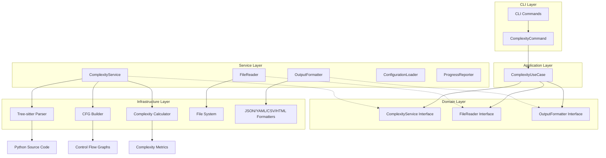

# Architecture Overview

## System Design

pyscn follows **Clean Architecture** principles with clear separation of concerns and dependency inversion. The system is designed as a modular, high-performance static analysis tool for Python code.



## Clean Architecture Layers

### 1. **Domain Layer** (`domain/`)

The innermost layer containing business rules and entities. No dependencies on external frameworks.

```go
// domain/complexity.go
type ComplexityService interface {
    Analyze(ctx context.Context, req ComplexityRequest) (ComplexityResponse, error)
    AnalyzeFile(ctx context.Context, filePath string, req ComplexityRequest) (ComplexityResponse, error)
}

type FileReader interface {
    CollectPythonFiles(paths []string, recursive bool, include, exclude []string) ([]string, error)
    IsValidPythonFile(path string) bool
}

type OutputFormatter interface {
    Write(response ComplexityResponse, format OutputFormat, writer io.Writer) error
}

type ComplexityRequest struct {
    Paths            []string
    OutputFormat     OutputFormat
    OutputWriter     io.Writer
    MinComplexity    int
    MaxComplexity    int
    SortBy          SortCriteria
    LowThreshold    int
    MediumThreshold int
    ShowDetails     bool
    Recursive       bool
    IncludePatterns []string
    ExcludePatterns []string
    ConfigPath      string
}
```

### 2. **Application Layer** (`app/`)

Orchestrates business logic and coordinates between domain services.

```go
// app/complexity_usecase.go
type ComplexityUseCase struct {
    service       domain.ComplexityService
    fileReader    domain.FileReader
    formatter     domain.OutputFormatter
    configLoader  domain.ConfigurationLoader
    progress      domain.ProgressReporter
}

func (uc *ComplexityUseCase) Execute(ctx context.Context, req domain.ComplexityRequest) error {
    // 1. Validate input
    // 2. Load configuration
    // 3. Collect Python files
    // 4. Perform analysis
    // 5. Format and output results
}
```

### 3. **Service Layer** (`service/`)

Implements domain interfaces with concrete business logic.

```go
// service/complexity_service.go
type ComplexityService struct {
    progress domain.ProgressReporter
}

func (s *ComplexityService) Analyze(ctx context.Context, req domain.ComplexityRequest) (domain.ComplexityResponse, error) {
    // Implements the complexity analysis workflow
}
```

### 4. **CLI Layer** (`cmd/pyscn/`)

Thin adapter layer that handles user input and delegates to application layer.

```go
// cmd/pyscn/complexity_clean.go
type ComplexityCommand struct {
    outputFormat    string
    minComplexity   int
    maxComplexity   int
    // ... other CLI flags
}

func (c *ComplexityCommand) runComplexityAnalysis(cmd *cobra.Command, args []string) error {
    // 1. Parse CLI flags into domain request
    // 2. Create use case with dependencies
    // 3. Execute use case
    // 4. Handle errors appropriately
}
```

## Core Components

### 1. Parser Module (`internal/parser`)

The parser module handles Python code parsing using tree-sitter.

```go
// internal/parser/parser.go
type Parser struct {
    language *sitter.Language
    parser   *sitter.Parser
}

type Node struct {
    Type     NodeType
    Value    string
    Children []*Node
    Location Location
}

type Location struct {
    File  string
    Line  int
    Col   int
}
```

**Responsibilities:**
- Parse Python source files
- Build internal AST representation
- Handle syntax errors gracefully
- Support Python 3.8+ syntax

**Key Files:**
- `parser.go`: Main parser implementation
- `python.go`: Python-specific parsing logic
- `ast.go`: AST node definitions
- `visitor.go`: AST visitor pattern implementation

### 2. Analyzer Module (`internal/analyzer`)

The analyzer module contains the core analysis algorithms.

#### 2.1 Control Flow Graph (CFG)

```go
// internal/analyzer/cfg.go
type CFG struct {
    Entry  *BasicBlock
    Exit   *BasicBlock
    Blocks map[string]*BasicBlock
}

type BasicBlock struct {
    ID          string
    Statements  []ast.Node
    Successors  []*BasicBlock
    Predecessors []*BasicBlock
}

type CFGBuilder struct {
    current *BasicBlock
    cfg     *CFG
    loops   []LoopContext
    breaks  []BreakContext
}
```

**Algorithm:**
1. Create entry and exit blocks
2. Process statements sequentially
3. Handle control flow statements:
   - `if/elif/else`: Create branches
   - `for/while`: Create loop structures
   - `break/continue`: Update loop edges
   - `return`: Connect to exit block
   - `try/except`: Handle exception flow

#### 2.2 Dead Code Detection

```go
// internal/analyzer/dead.go
type DeadCodeDetector struct {
    cfg      *CFG
    reached  map[string]bool
    liveVars map[string]VarInfo
}

type Finding struct {
    Type     FindingType
    Location Location
    Message  string
    Severity Severity
}
```

**Algorithm:**
1. Mark entry block as reachable
2. Perform breadth-first traversal
3. Mark all visited blocks as reachable
4. Report unreachable blocks as dead code
5. Analyze variable usage for unused detection

#### 2.3 APTED Clone Detection with LSH Acceleration

```go
// internal/analyzer/apted.go
type APTEDAnalyzer struct {
    threshold float64
    costModel CostModel
    lsh       *LSHIndex  // LSH acceleration for large projects
}

type TreeNode struct {
    Label    string
    Children []*TreeNode
    Parent   *TreeNode
    ID       int
    Features []uint64    // Hash features for LSH
}

type CostModel interface {
    Insert(node *TreeNode) float64
    Delete(node *TreeNode) float64
    Rename(node1, node2 *TreeNode) float64
}

// LSH (Locality-Sensitive Hashing) for acceleration
type LSHIndex struct {
    bands     int
    rows      int
    hashes    int
    buckets   map[string][]*CodeFragment
    extractor *FeatureExtractor
}

type FeatureExtractor struct {
    // Extract features for LSH hashing
    SubtreeHashes bool
    KGrams        int
    Patterns      []string
}
```

**Two-Stage Detection Process:**

**Stage 1: LSH Candidate Generation (for large projects)**
1. Extract AST features (subtree hashes, k-grams, patterns)
2. Apply MinHash + LSH banding to find candidate pairs
3. Filter candidates by similarity threshold
4. Early termination for dissimilar pairs

**Stage 2: APTED Verification**
1. Convert candidate pairs to ordered trees
2. Compute precise tree edit distance using APTED
3. Use dynamic programming with path decomposition
4. Compare distance against threshold
5. Apply advanced grouping algorithms

**Clone Grouping Algorithms:**

```go
type GroupingMode string

const (
    GroupingModeConnected     GroupingMode = "connected"      // Connected components
    GroupingModeStar          GroupingMode = "star"           // Star/medoid clustering
    GroupingModeCompleteLinkage GroupingMode = "complete_linkage" // Complete linkage clustering
    GroupingModeKCore         GroupingMode = "k_core"         // K-core decomposition
)

type CloneGroup struct {
    ID         string
    Clones     []*Clone
    Centroid   *Clone          // Representative clone
    Similarity float64         // Intra-group similarity
    Algorithm  GroupingMode    // Grouping algorithm used
}
```

1. **Connected Components**: Groups clones based on similarity edges
2. **Star/Medoid**: Finds representative (medoid) and groups around it
3. **Complete Linkage**: Hierarchical clustering with maximum distance constraint
4. **K-Core**: Identifies densely connected clone groups

### 3. Configuration Module (`internal/config`)

The configuration system implements TOML-only configuration discovery similar to Ruff, with support for both dedicated `.pyscn.toml` files and `pyproject.toml` integration.

```go
// internal/config/config.go
type Config struct {
    // Analysis settings
    DeadCode   DeadCodeConfig   `toml:"dead_code"`
    Clones     PyscnConfig      `toml:"clones"`
    Complexity ComplexityConfig `toml:"complexity"`
    CBO        CBOConfig        `toml:"cbo"`
    
    // Output settings
    Output     OutputConfig     `toml:"output"`
    
    // File patterns
    Analysis   AnalysisConfig   `toml:"analysis"`
}

type OutputConfig struct {
    Format        string `toml:"format"`
    Directory     string `toml:"directory"` // Output directory for reports
    ShowDetails   bool   `toml:"show_details"`
    SortBy        string `toml:"sort_by"`
    MinComplexity int    `toml:"min_complexity"`
}

type PyscnConfig struct {
    // Analysis parameters
    MinLines          int     `toml:"min_lines"`
    MinNodes          int     `toml:"min_nodes"`
    SimilarityThreshold float64 `toml:"similarity_threshold"`
    
    // LSH acceleration
    LSH LSHConfig `toml:"lsh"`
    
    // Grouping algorithms
    Grouping GroupingConfig `toml:"grouping"`
}

type LSHConfig struct {
    Enabled           string  `toml:"enabled"`           // "true", "false", "auto"
    AutoThreshold     int     `toml:"auto_threshold"`     // Auto-enable for projects >N files
    SimilarityThreshold float64 `toml:"similarity_threshold"`
    Bands             int     `toml:"bands"`
    Rows              int     `toml:"rows"`
    Hashes            int     `toml:"hashes"`
}

type GroupingConfig struct {
    Mode      string  `toml:"mode"`      // "connected", "star", "complete_linkage", "k_core"
    Threshold float64 `toml:"threshold"`
    KCoreK    int     `toml:"k_core_k"`
}
```

#### Configuration Discovery Algorithm

pyscn uses a TOML-only hierarchical configuration discovery system:

```go
// LoadConfigWithTarget searches for configuration in this order:
func LoadConfigWithTarget(configPath string, targetPath string) (*Config, error) {
    // 1. Explicit config path (highest priority)
    if configPath != "" {
        return loadFromFile(configPath)
    }
    
    // 2. Search from target directory upward
    if targetPath != "" {
        if config := searchUpward(targetPath); config != "" {
            return loadFromFile(config)
        }
    }
    
    // 3. Current directory
    if config := findInDirectory("."); config != "" {
        return loadFromFile(config)
    }
    
    // 4. Default configuration
    return DefaultConfig(), nil
}
```

**Configuration File Priority:**
1. `.pyscn.toml` (dedicated config file)
2. `pyproject.toml` (with `[tool.pyscn]` section)

**Search Strategy:**
- **Target Directory & Parents**: Starting from the analysis target, search upward to filesystem root
- **TOML-only**: Simplified configuration strategy focusing on modern TOML format

### 4. CLI Module (`cmd/pyscn`)

The CLI layer uses the Command pattern with Cobra framework.

```go
// cmd/pyscn/main.go - Root command setup
type CLI struct {
    rootCmd *cobra.Command
}

// cmd/pyscn/complexity_clean.go - Command implementation
type ComplexityCommand struct {
    outputFormat    string
    minComplexity   int
    maxComplexity   int
    sortBy          string
    showDetails     bool
    configFile      string
    lowThreshold    int
    mediumThreshold int
    verbose         bool
}

// Available Commands:
// - complexity: Calculate McCabe cyclomatic complexity
// - deadcode: Find unreachable code using CFG analysis
// - clone: Detect code clones using APTED with LSH acceleration
// - cbo: Analyze Coupling Between Objects metrics
// - analyze: Run comprehensive analysis with unified reporting
// - check: Quick CI-friendly quality check
// - init: Generate configuration file
```

## Dependency Injection & Builder Pattern

The system uses dependency injection to achieve loose coupling and testability.

```go
// app/complexity_usecase.go - Builder pattern for complex object creation
type ComplexityUseCaseBuilder struct {
    service      domain.ComplexityService
    fileReader   domain.FileReader
    formatter    domain.OutputFormatter
    configLoader domain.ConfigurationLoader
    progress     domain.ProgressReporter
}

func NewComplexityUseCaseBuilder() *ComplexityUseCaseBuilder
func (b *ComplexityUseCaseBuilder) WithService(service domain.ComplexityService) *ComplexityUseCaseBuilder
func (b *ComplexityUseCaseBuilder) WithFileReader(fileReader domain.FileReader) *ComplexityUseCaseBuilder
func (b *ComplexityUseCaseBuilder) Build() (*ComplexityUseCase, error)

// cmd/pyscn/complexity_clean.go - Dependency assembly
func (c *ComplexityCommand) createComplexityUseCase(cmd *cobra.Command) (*app.ComplexityUseCase, error) {
    // Create services
    fileReader := service.NewFileReader()
    formatter := service.NewOutputFormatter()
    configLoader := service.NewConfigurationLoader()
    progress := service.CreateProgressReporter(cmd.ErrOrStderr(), 0, c.verbose)
    complexityService := service.NewComplexityService(progress)

    // Build use case with dependencies
    return app.NewComplexityUseCaseBuilder().
        WithService(complexityService).
        WithFileReader(fileReader).
        WithFormatter(formatter).
        WithConfigLoader(configLoader).
        WithProgress(progress).
        Build()
}
```

## Data Flow

### 1. Input Processing

```
Source File → Read → Tokenize → Parse → AST
```

### 2. Analysis Pipeline

```
AST → CFG Construction → Dead Code Analysis → Results
    ↘                                      ↗
      APTED Analysis → Clone Detection → 
```

### 3. Output Generation

```
Results → Aggregation → Formatting → Output (CLI/JSON/SARIF)
```

## Performance Optimizations

### 1. Parallel Processing

- Parse multiple files concurrently
- Run independent analyses in parallel
- Use worker pools for large codebases
- Batch processing for clone detection

```go
type WorkerPool struct {
    workers   int
    jobs      chan Job
    results   chan Result
    waitGroup sync.WaitGroup
}

type BatchProcessor struct {
    batchSize   int
    maxMemoryMB int
    timeout     time.Duration
}
```

### 2. LSH Acceleration

- Automatic LSH activation for large projects (>500 files)
- Two-stage detection: LSH candidates + APTED verification
- Configurable hash functions and banding parameters
- Early termination for dissimilar pairs

```go
type LSHConfig struct {
    Enabled           string  // "auto", "true", "false"
    AutoThreshold     int     // Auto-enable threshold
    SimilarityThreshold float64
    Bands             int
    Rows              int
    Hashes            int
}
```

### 3. Memory Management

- Stream large files instead of loading entirely
- Reuse AST nodes where possible
- Clear unused CFG blocks after analysis
- Use object pools for frequent allocations
- Memory-aware batch processing

### 4. Caching (Future Enhancement)

**Note: Caching is not yet implemented in v1.0.0. This section describes the planned architecture for future releases.**

Planned caching features:
- Cache parsed ASTs for unchanged files
- Store CFGs for incremental analysis
- Memoize APTED distance calculations
- LSH signature caching

```go
// Planned implementation (not yet available)
type Cache struct {
    ast       map[string]*AST      // File hash → AST
    cfg       map[string]*CFG      // Function → CFG
    dist      map[string]float64   // Node pair → distance
    lshSigs   map[string][]uint64  // File → LSH signatures
}
```

## Error Handling

### Error Types

```go
type ErrorType int

const (
    ParseError ErrorType = iota
    AnalysisError
    ConfigError
    IOError
)

type Error struct {
    Type     ErrorType
    Message  string
    Location *Location
    Cause    error
}
```

### Recovery Strategies

1. **Parse Errors**: Skip problematic file, continue with others
2. **Analysis Errors**: Report partial results, mark incomplete
3. **Config Errors**: Use defaults, warn user
4. **IO Errors**: Retry with backoff, then fail gracefully

## Extension Points

### 1. Custom Analyzers

```go
type Analyzer interface {
    Name() string
    Analyze(ast *AST) ([]Finding, error)
    Configure(config map[string]interface{}) error
}
```

### 2. Output Formatters

```go
type Formatter interface {
    Format(findings []Finding) ([]byte, error)
    Extension() string
    ContentType() string
}
```

### 3. Language Support

```go
type Language interface {
    Name() string
    Parse(source []byte) (*AST, error)
    GetGrammar() *sitter.Language
}
```

## Testing Strategy

pyscn follows a comprehensive testing approach with multiple layers of validation.

### 1. Unit Tests

Test individual components in isolation with dependency injection.

```go
// domain/complexity_test.go - Domain entity tests
func TestOutputFormat(t *testing.T) {
    tests := []struct {
        name   string
        format OutputFormat
        valid  bool
    }{
        {"Text format", OutputFormatText, true},
        {"JSON format", OutputFormatJSON, true},
        {"Invalid format", OutputFormat("invalid"), false},
    }
    // Table-driven test implementation
}

// internal/analyzer/complexity_test.go - Algorithm tests
func TestCalculateComplexity(t *testing.T) {
    tests := []struct {
        name     string
        cfg      *CFG
        expected int
    }{
        {"Simple function", createSimpleCFG(), 1},
        {"If statement", createIfCFG(), 2},
        {"Nested conditions", createNestedCFG(), 4},
    }
    // Algorithm validation
}
```

**Coverage**: >80% across all packages
**Approach**: Table-driven tests, dependency mocking, boundary condition testing

### 2. Integration Tests

Test layer interactions and workflows with real dependencies.

```go
// integration/complexity_integration_test.go
func TestComplexityCleanFiltering(t *testing.T) {
    // Create services (real implementations)
    fileReader := service.NewFileReader()
    outputFormatter := service.NewOutputFormatter()
    configLoader := service.NewConfigurationLoader()
    progressReporter := service.NewNoOpProgressReporter()
    complexityService := service.NewComplexityService(progressReporter)

    // Create use case with real dependencies
    useCase := app.NewComplexityUseCase(
        complexityService,
        fileReader,
        outputFormatter,
        configLoader,
        progressReporter,
    )

    // Test with real Python files and verify results
}
```

**Scope**: Service layer interactions, use case workflows, configuration loading
**Data**: Real Python code samples in `testdata/`

### 3. End-to-End Tests

Test complete user workflows through the CLI interface.

```go
// e2e/complexity_e2e_test.go
func TestComplexityE2EBasic(t *testing.T) {
    // Build actual binary
    binaryPath := buildPyscnBinary(t)
    defer os.Remove(binaryPath)

    // Create test Python files
    testDir := t.TempDir()
    createTestPythonFile(t, testDir, "simple.py", pythonCode)

    // Execute CLI command
    cmd := exec.Command(binaryPath, "complexity", testDir)
    var stdout, stderr bytes.Buffer
    cmd.Stdout = &stdout
    cmd.Stderr = &stderr

    // Verify output and exit code
    err := cmd.Run()
    assert.NoError(t, err)
    assert.Contains(t, stdout.String(), "simple_function")
}
```

**Scenarios**:
- Basic analysis with text output
- JSON format validation  
- CLI flag parsing and validation
- Error handling (missing files, invalid arguments)
- Multiple file analysis

### 4. Command Interface Tests

Test CLI command structure and validation without full execution.

```go
// cmd/pyscn/complexity_test.go
func TestComplexityCommandInterface(t *testing.T) {
    complexityCmd := NewComplexityCommand()
    cobraCmd := complexityCmd.CreateCobraCommand()
    
    // Test command structure
    assert.Equal(t, "complexity [files...]", cobraCmd.Use)
    assert.NotEmpty(t, cobraCmd.Short)
    
    // Test flags are properly configured
    expectedFlags := []string{"format", "min", "max", "sort", "details"}
    for _, flagName := range expectedFlags {
        flag := cobraCmd.Flags().Lookup(flagName)
        assert.NotNil(t, flag, "Flag %s should be defined", flagName)
    }
}
```

### 5. Test Data Organization

```
testdata/
├── python/
│   ├── simple/           # Basic Python constructs
│   │   ├── functions.py  # Simple function definitions
│   │   ├── classes.py    # Class definitions
│   │   └── control_flow.py # Basic if/for/while
│   ├── complex/          # Complex code patterns
│   │   ├── exceptions.py # Try/except/finally
│   │   ├── async_await.py # Async/await patterns
│   │   └── comprehensions.py # List/dict comprehensions
│   └── edge_cases/       # Edge cases and errors
│       ├── nested_structures.py # Deep nesting
│       ├── syntax_errors.py # Invalid syntax
│       └── python310_features.py # Modern Python features
├── integration/          # Integration test fixtures
└── e2e/                 # E2E test temporary files
```

### 6. Performance & Benchmark Tests

```go
// internal/analyzer/complexity_benchmark_test.go
func BenchmarkComplexityCalculation(b *testing.B) {
    cfg := createLargeCFG() // CFG with 1000+ nodes
    
    b.ResetTimer()
    for i := 0; i < b.N; i++ {
        result := CalculateComplexity(cfg)
        _ = result // Prevent compiler optimization
    }
}

// Benchmark targets:
// - Parser performance: >100,000 lines/second
// - CFG construction: >10,000 lines/second
// - Complexity calculation: <1ms per function
```

### 7. Test Execution

```bash
# Run all tests
go test ./...

# Run with coverage
go test -cover ./...

# Run specific test suites
go test ./cmd/pyscn        # Command interface tests
go test ./integration     # Integration tests  
go test ./e2e             # End-to-end tests

# Run benchmarks
go test -bench=. ./internal/analyzer
```

### 8. Continuous Integration

All tests run automatically on:
- **Go 1.24**: Current version
- **Go 1.25**: Latest stable version (when available)
- **Linux, macOS, Windows**: Cross-platform compatibility

**Quality Gates**:
- All tests must pass
- Code coverage >80%
- No linting errors
- Build success on all platforms

## Security Considerations

### 1. Input Validation

- Validate file paths
- Limit file sizes
- Sanitize configuration
- Check for path traversal

### 2. Resource Limits

- Cap memory usage
- Limit goroutines
- Timeout long operations
- Prevent infinite loops

### 3. Safe Parsing

- Handle malformed code
- Prevent parser exploits
- Validate AST depth
- Limit recursion

## Development Progress & Roadmap

### Phase 1 (MVP - Completed September 2025)
- [x] **Clean Architecture Implementation** - Domain-driven design with dependency injection
- [x] **Tree-sitter Integration** - Python parsing with go-tree-sitter
- [x] **CFG Construction** - Control Flow Graph building for all Python constructs
- [x] **Complexity Analysis** - McCabe cyclomatic complexity with risk assessment
- [x] **CLI Framework** - Cobra-based command interface with multiple output formats
- [x] **Comprehensive Testing** - Unit, integration, and E2E test suites
- [x] **CI/CD Pipeline** - Automated testing on multiple Go versions and platforms
- [x] **Dead Code Detection** - CFG-based unreachable code identification
- [x] **APTED Clone Detection** - Tree edit distance for code similarity with LSH acceleration
- [x] **Configuration System** - TOML-only configuration with hierarchical discovery
- [x] **CBO Analysis** - Coupling Between Objects metrics
- [x] **Advanced Clone Grouping** - Multiple algorithms (connected, star, complete linkage, k-core)
- [x] **HTML Reports** - Rich web-based analysis reports

### Future Roadmap (2026 and beyond)

**Performance & Scalability (Q1 2026)**
- [ ] **Incremental Analysis** - Only analyze changed files for faster CI/CD
- [ ] **Distributed Processing** - Multi-node analysis for enterprise codebases
- [ ] **Enhanced Caching** - Persistent analysis cache across runs
- [ ] **Memory Optimizations** - Further reduce memory footprint

**Developer Experience (Q2 2026)**
- [ ] **VS Code Extension** - Real-time analysis in editor with inline suggestions
- [ ] **IDE Integrations** - JetBrains, Vim, Emacs plugins
- [ ] **Watch Mode** - Continuous analysis during development
- [ ] **Interactive CLI** - TUI interface for exploring results

**Advanced Analysis (Q3-Q4 2026)**
- [ ] **Type Inference Integration** - Enhanced analysis with type information
- [ ] **Semantic Clone Detection** - Beyond structural similarity
- [ ] **Auto-fix Capabilities** - Automated refactoring suggestions
- [ ] **Dependency Analysis** - Import graph analysis and unused dependency detection
- [ ] **Security Analysis** - Static security vulnerability detection

**Enterprise Features (2027+)**
- [ ] **Multi-language Support** - JavaScript, TypeScript, Go, Rust analysis
- [ ] **Cloud Analysis Service** - SaaS offering for enterprise teams
- [ ] **Team Analytics** - Code quality trends and team insights
- [ ] **LLM-powered Suggestions** - AI-driven code improvement recommendations

### Current Status (September 2025)

**Completed Features:**
- ✅ Full clean architecture with proper separation of concerns
- ✅ McCabe complexity analysis with configurable thresholds
- ✅ Multiple output formats (text, JSON, YAML, CSV, HTML)
- ✅ CLI with comprehensive flag support and validation
- ✅ Robust error handling with domain-specific error types
- ✅ Builder pattern for dependency injection
- ✅ Comprehensive test coverage (unit, integration, E2E)
- ✅ CI/CD pipeline with cross-platform testing
- ✅ Dead code detection with CFG analysis
- ✅ APTED clone detection with LSH acceleration
- ✅ CBO (Coupling Between Objects) analysis
- ✅ Advanced clone grouping algorithms
- ✅ Unified analyze command with HTML reports

**Recently Completed:**
- ✅ TOML-only configuration system (.pyscn.toml, pyproject.toml)
- ✅ LSH-based clone detection acceleration for large projects
- ✅ Multiple grouping modes (connected, star, complete linkage, k-core)
- ✅ Performance optimizations and batch processing

**Performance Benchmarks:**
- Parser: >100,000 lines/second ✅
- CFG Construction: >25,000 lines/second ✅ 
- Complexity Calculation: <0.1ms per function ✅
- Clone Detection: >10,000 lines/second with LSH acceleration ✅
- LSH Candidate Generation: >500,000 functions/second ✅

## Dependencies

### Core Dependencies

```go
// go.mod
require (
    github.com/smacker/go-tree-sitter v0.0.0-20240827094217-dd81d9e9be82
    github.com/spf13/cobra v1.9.1
    github.com/spf13/viper v1.20.1
    github.com/pelletier/go-toml/v2 v2.2.3
    github.com/stretchr/testify v1.10.0
)
```

### Development Dependencies

```go
require (
    github.com/stretchr/testify v1.8.4
    github.com/golangci/golangci-lint v1.55.2
    golang.org/x/tools v0.17.0
)
```

## Configuration Examples

### Basic Configuration

```toml
# .pyscn.toml
[dead_code]
enabled = true
min_severity = "warning"
show_context = false

[clones]
min_lines = 5
similarity_threshold = 0.8
lsh_enabled = "auto"

[output]
format = "text"
sort_by = "name"

[analysis]
exclude_patterns = [
    "test_*.py",
    "*_test.py",
    "**/migrations/**"
]
```

### Advanced Configuration

```toml
# .pyscn.toml or pyproject.toml [tool.pyscn] section
[dead_code]
enabled = true
min_severity = "warning"
show_context = true
context_lines = 3
ignore_patterns = ["__all__", "_*"]

[clones]
min_lines = 10
min_nodes = 20
similarity_threshold = 0.7
type1_threshold = 0.98
type2_threshold = 0.95
type3_threshold = 0.85
type4_threshold = 0.70
max_results = 1000

# LSH acceleration for large projects
[clones.lsh]
enabled = "auto"
auto_threshold = 500
similarity_threshold = 0.78
bands = 32
rows = 4
hashes = 128

# Clone grouping algorithms
[clones.grouping]
mode = "connected"  # connected | star | complete_linkage | k_core
threshold = 0.85
k_core_k = 2

[complexity]
enabled = true
low_threshold = 9
medium_threshold = 19
max_complexity = 0

[cbo]
enabled = true
low_threshold = 5
medium_threshold = 10
include_builtins = false

[output]
format = "html"
directory = "reports"
show_details = true

[analysis]
recursive = true
include_patterns = ["src/**/*.py", "lib/**/*.py"]
exclude_patterns = [
    "test_*.py",
    "*_test.py", 
    "**/migrations/**",
    "**/__pycache__/**"
]
```

## Metrics and Monitoring

### Analysis Metrics

- Files analyzed
- Lines processed
- Findings detected
- Analysis duration
- Memory peak usage

### Quality Metrics

- False positive rate
- Detection accuracy
- Performance benchmarks
- User satisfaction

### Telemetry (Optional)

```go
type Telemetry struct {
    Version   string
    OS        string
    Arch      string
    FileCount int
    LineCount int
    Duration  time.Duration
    Findings  map[string]int
}
```

## Conclusion

This architecture provides a solid foundation for a high-performance Python static analysis tool. The modular design allows for easy extension and maintenance, while the performance optimizations ensure scalability to large codebases.