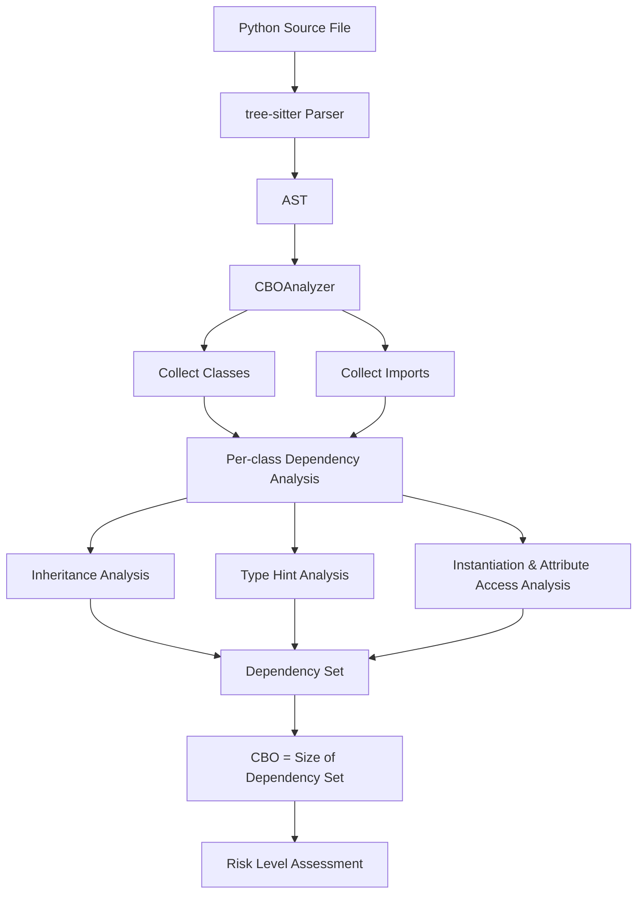

# CBO (Coupling Between Objects) Algorithm

This document describes the design and implementation of the CBO analysis algorithm in pyscn. The core implementation resides in `internal/analyzer/cbo.go`, domain definitions in `domain/cbo.go`, and the service layer in `service/cbo_service.go`.

## Overview

### What is CBO?

CBO (Coupling Between Objects) is one of the object-oriented design metrics proposed by Chidamber & Kemerer (1994). It measures the number of distinct classes a given class depends on, providing a quantitative assessment of inter-class coupling.

A higher CBO value indicates greater dependency on external classes, which increases the following risks:

- **Change propagation**: Changes to dependent classes may ripple into this class
- **Testing difficulty**: More mocks and stubs are required for unit testing
- **Reduced reusability**: The class becomes harder to reuse in different contexts
- **Comprehension overhead**: Understanding the class requires knowledge of many other classes

### Academic Background

Reference: Chidamber, S.R. & Kemerer, C.F. (1994). "A Metrics Suite for Object Oriented Design", IEEE Transactions on Software Engineering, 20(6), 476-493.

CBO was originally defined as the count of other classes to which a given class is coupled. pyscn adapts this definition for Python code structures, detecting the dependency types described below.

## Analysis Architecture



The analysis executes in two passes:

1. **Pass 1**: Walk the AST to collect all class definitions and import statements
2. **Pass 2**: For each class, analyze dependencies and compute the CBO value

## Dependency Detection

pyscn detects five types of dependencies. Each dependency is tracked as a unique class name in a set, so multiple references to the same class are counted only once.

### 1. Inheritance Dependencies

Base class declarations are detected as dependencies.

```python
from abc import ABC

class Animal(ABC):          # Dependency on ABC
    pass

class Dog(Animal):          # Dependency on Animal
    pass

class GuideDog(Dog, Serializable):  # Dependencies on Dog and Serializable
    pass
```

The implementation iterates over the `classNode.Bases` field and extracts each base class name (`internal/analyzer/cbo.go:172-188`).

### 2. Type Hint Dependencies

Class names appearing in type annotations are detected as dependencies.

```python
class OrderService:
    repository: OrderRepository        # Dependency on OrderRepository
    logger: Logger                      # Dependency on Logger

    def process(self, order: Order) -> Result:  # Dependencies on Order, Result
        pass

    def find_all(self) -> list[Order]:  # Dependency on Order (generic type)
        pass
```

The following type annotation structures are recursively parsed:

| AST Node Type | Python Code Example | Processing |
|---|---|---|
| `Name` | `User` | Extracted directly as a class name |
| `Subscript` | `List[User]`, `Dict[str, User]` | Type parameter portion recursively parsed |
| `Attribute` | `mymodule.MyClass` | Extracted as a module-qualified class name |
| `BinOp` (op=`\|`) | `Context \| None` | Both sides of the union recursively parsed |
| `GenericType` | Generic types | TypeParameter children recursively parsed |
| `TypeNode` | tree-sitter type node | Children recursively parsed |

### 3. Instantiation Dependencies

Class instantiation is detected as a dependency.

```python
class UserService:
    def __init__(self):
        self.repo = UserRepository()   # Dependency on UserRepository
        self.cache = RedisCache()      # Dependency on RedisCache
```

Detection logic (`internal/analyzer/cbo.go:319-385`):

1. Walk `NodeCall` and `NodeAssign` nodes
2. Extract the callee name from the AST structure
3. Add as a dependency under these conditions:
   - Matches an imported name -> counted as `ImportDependencies`
   - Matches a known local class in the same file -> counted as `InstantiationDependencies`
   - Matches a built-in type when `IncludeBuiltins` is enabled -> counted as `InstantiationDependencies`
4. Function calls (non-class callables) are **not** added as dependencies

### 4. Attribute Access Dependencies

Method calls and attribute references on objects are detected as dependencies.

```python
class ReportGenerator:
    def generate(self, data):
        formatted = self.formatter.format(data)  # Dependency on formatter's type
        self.logger.info("Report generated")      # Dependency on logger's type
```

The type of the object is inferred from the `Left` field of `NodeAttribute` nodes. If the name exists in the import name mapping, the fully-qualified name is used.

### 5. Import Dependencies

When any of the above dependencies originates from an imported name, it is counted as `ImportDependencies`.

```python
from services.auth import AuthService
from models import User

class ProfileService:
    auth: AuthService    # AuthService is import-derived -> ImportDependencies
    user: User           # User is import-derived -> ImportDependencies
```

Import name resolution (`internal/analyzer/cbo.go:404-443`):

| Import Form | Alias | Mapping |
|---|---|---|
| `import json` | `json` | `json` |
| `import json as j` | `j` | `json` |
| `from models import User` | `User` | `models.User` |
| `from models import User as U` | `U` | `models.User` |

## Union Type Support (Python 3.10+)

The `X | Y` union type syntax introduced in Python 3.10 is fully supported.

```python
class Handler:
    context: Context | None         # Dependency on Context (None is a builtin, excluded)
    input: Request | Response       # Dependencies on Request and Response
    data: str | int | CustomType    # Dependency on CustomType (str, int are builtins, excluded)
```

In the AST this is represented as a `BinOp` node with operator `|`. Both the `Left` and `Right` subtrees are recursively parsed (`internal/analyzer/cbo.go:279-290`). Nested unions (`A | B | C`) are correctly handled through the recursive structure.

## Filtering

### Built-in Type Exclusion

By default, Python built-in types are not counted as dependencies (`IncludeBuiltins=false`).

**Excluded built-in types** (`internal/analyzer/cbo.go:732-738`):
`bool`, `int`, `float`, `complex`, `str`, `bytes`, `bytearray`, `list`, `tuple`, `range`, `dict`, `set`, `frozenset`, `object`, `type`, `super`, `property`, `classmethod`, `staticmethod`, `Exception`, `BaseException`, various exception classes, `memoryview`, `slice`

**Always excluded built-in functions** (`internal/analyzer/cbo.go:742-749`):
`print`, `len`, `max`, `min`, `sum`, `abs`, `sorted`, `isinstance`, `getattr`, `setattr`, etc. -- these are functions, not class dependencies, and are always excluded regardless of the `IncludeBuiltins` setting.

### Standard Library Exclusion

When `IncludeImports=true` (the default), imported modules are included as dependencies. Setting `IncludeImports=false` excludes standard library modules.

Excluded standard library modules (`internal/analyzer/cbo.go:762-766`):
`os`, `sys`, `re`, `json`, `datetime`, `collections`, `itertools`, `functools`, `operator`, `math`, `random`, `string`, `io`, `pathlib`, `unittest`, `logging`, `argparse`, `configparser`, `urllib`, `http`

### Class Exclusion Patterns

Default exclusion patterns: `test_*`, `*_test`, `__*__`

Setting `PublicClassesOnly=true` also excludes private classes prefixed with an underscore (`_PrivateClass`).

## CBO Value Calculation

The CBO value is computed as the size of the dependency set:

```
CBO = |dependency set|
```

Multiple dependency types referencing the same class (e.g., both inheritance and type hint) are counted only once. The implementation uses a `map[string]bool` to guarantee uniqueness (`internal/analyzer/cbo.go:148-162`).

### Worked Example

```python
from models import User, Order

class OrderService(BaseService):          # Building the dependency set:
    repository: OrderRepository           #   {BaseService, OrderRepository,
    cache: CacheManager                   #    CacheManager, User, Order,
                                          #    NotificationService}
    def create_order(self, user: User) -> Order:
        notification = NotificationService()
        return Order()                    # Order is already in the set, no duplicate
```

CBO = 6 (BaseService, OrderRepository, CacheManager, User, Order, NotificationService)

## Risk Thresholds

Risk levels are determined based on the CBO value. Thresholds are based on industry standards from the Chidamber & Kemerer metrics suite (`domain/defaults.go:114-121`).

| Risk Level | CBO Range | Condition | Meaning |
|---|---|---|---|
| **Low** | CBO <= 3 | `cbo <= LowThreshold` | Well-encapsulated class |
| **Medium** | 4 <= CBO <= 7 | `cbo <= MediumThreshold` | Refactoring should be considered |
| **High** | CBO > 7 | `cbo > MediumThreshold` | Highly coupled; splitting or refactoring recommended |

Default thresholds:
- `DefaultCBOLowThreshold = 3`
- `DefaultCBOMediumThreshold = 7`

Thresholds are customizable via command-line flags or the configuration file (`.pyscn.toml`).

## Health Score Integration

In the `pyscn analyze` command's overall health score calculation, CBO contributes as the **Coupling (CBO)** category with a maximum penalty of 20 points (`domain/analyze.go:258-278`).

### Penalty Calculation

```
weightedRatio = (HighRiskClasses * 1.0 + MediumRiskClasses * 0.5) / TotalAnalyzedClasses

penalty = min(20, weightedRatio / 0.25 * 20)
```

- High Risk classes (CBO > 7) have a weight of 1.0
- Medium Risk classes (4 <= CBO <= 7) have a weight of 0.5
- Low Risk classes (CBO <= 3) contribute no penalty

The penalty is computed as a continuous linear function: 0 points at a weighted ratio of 0%, reaching the maximum of 20 points at 25%.

### Category Score

```
CouplingScore = 100 - (penalty / 20 * 100)
```

This is normalized to a 0-100 scale and displayed as part of the health score breakdown.

### Worked Examples

A project with 20 classes where 3 are High Risk and 4 are Medium Risk:

```
weightedRatio = (3 * 1.0 + 4 * 0.5) / 20 = 5.0 / 20 = 0.25
penalty = min(20, 0.25 / 0.25 * 20) = min(20, 20) = 20
CouplingScore = 100 - (20 / 20 * 100) = 0
```

A project with 20 classes where 1 is High Risk and 2 are Medium Risk:

```
weightedRatio = (1 * 1.0 + 2 * 0.5) / 20 = 2.0 / 20 = 0.10
penalty = min(20, 0.10 / 0.25 * 20) = min(20, 8) = 8
CouplingScore = 100 - (8 / 20 * 100) = 60
```

## Output Formats

CBO analysis results can be output in the following formats:

| Format | Use Case |
|---|---|
| `text` | Human-readable CLI output (default) |
| `json` | Programmatic consumption |
| `yaml` | Configuration file compatibility |
| `csv` | Spreadsheet analysis |
| `html` | Interactive report (auto-opens in browser) |

For each class, the following information is included:

- Class name, file path, line range
- CBO value and risk level
- Dependency breakdown by type (inheritance, type hints, instantiation, attribute access, imports)
- List of dependent classes
- Whether the class is abstract
- List of base classes

## Configuration

### Command-line Options

| Option | Default | Description |
|---|---|---|
| `--low-threshold` | 3 | Upper bound CBO value for Low risk |
| `--medium-threshold` | 7 | Upper bound CBO value for Medium risk |
| `--include-builtins` | false | Include built-in types as dependencies |
| `--include-imports` | true | Include imported modules as dependencies |
| `--min-cbo` | 0 | Minimum CBO value to display |
| `--max-cbo` | 0 (no limit) | Maximum CBO value to display |
| `--show-zeros` | false | Include classes with CBO = 0 |
| `--sort-by` | coupling | Sort criteria (coupling, name, risk, location) |

### Configuration File (.pyscn.toml)

```toml
[cbo]
low_threshold = 3
medium_threshold = 7
include_builtins = false
include_imports = true
min_cbo = 0
max_cbo = 0
show_zeros = false
```

Configuration priority: Command-line flags > Configuration file > Default values

## Implementation Notes

### AST Walker

The `walkNode` method (`internal/analyzer/cbo.go:636-659`) recursively traverses the AST, visiting the `Children`, `Body`, `Args`, and `Value` fields of each node. It uses a visitor pattern where returning `false` short-circuits traversal of the subtree.

### Regex Cache

Exclusion pattern matching caches compiled regular expressions for reuse (`internal/analyzer/cbo.go:696-718`). Patterns containing wildcards (`*`) are converted to regular expressions; patterns without wildcards use exact string matching.

### Abstract Class Detection

A class is identified as abstract if it contains at least one method decorated with `@abstractmethod` (`internal/analyzer/cbo.go:676-692`). Abstract classes are explicitly labeled in the output but are not excluded from CBO calculation.

## Related Documentation

- [Analyze Scoring Reference](../ANALYZE_SCORING.md) -- Position of the CBO penalty within the overall health score
