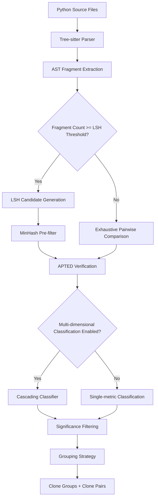
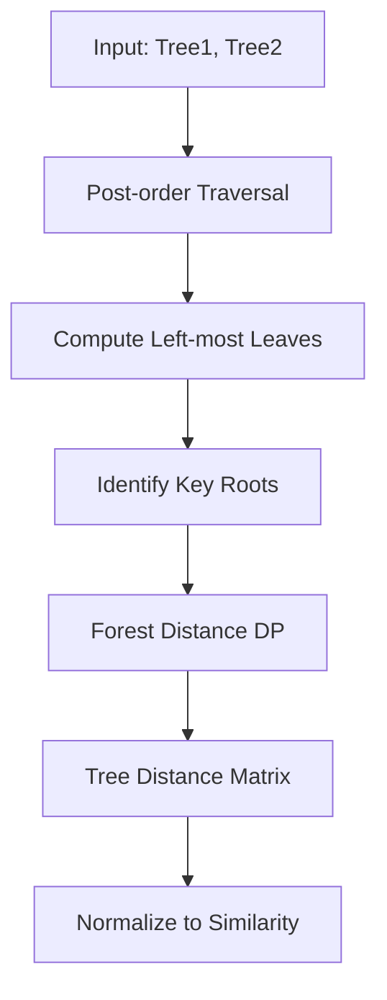
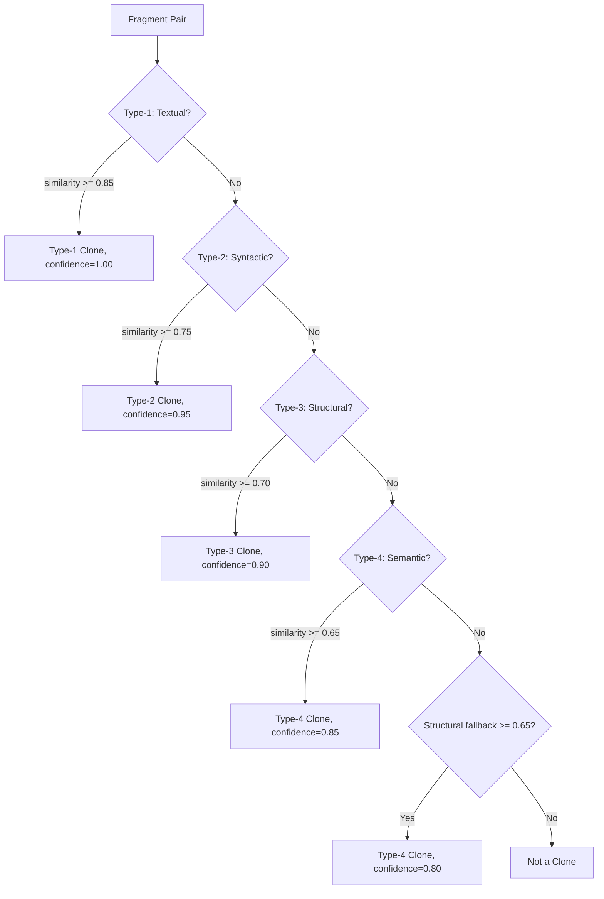
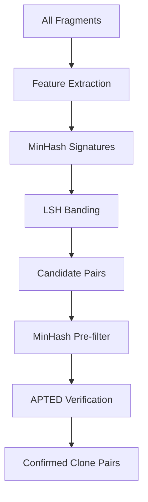

# Clone Detection Algorithm Reference

This document describes the clone detection algorithms implemented in pyscn. The implementation lives primarily in `internal/analyzer/` with domain types and thresholds defined in `domain/clone.go` and `domain/defaults.go`.

## Overview

Code clones are segments of source code that are similar or identical. They arise from copy-paste programming, framework boilerplate, and design patterns. While not always harmful, excessive duplication increases maintenance cost: a bug fix in one copy must be replicated across all others, and divergent evolution can introduce subtle inconsistencies.

pyscn's clone detector parses Python source code into ASTs via tree-sitter, converts those ASTs into ordered labeled trees, and then applies a cascade of algorithms -- from cheap textual hashing to expensive tree edit distance and control flow analysis -- to classify clone pairs into four standard types.

## Clone Type Classification

The taxonomy follows the standard four-type classification from clone detection research (Roy & Cordy, 2007; Bellon et al., 2007):

| Type | Name | Description | Default Threshold |
|------|------|-------------|-------------------|
| Type-1 | Identical | Identical code except whitespace, layout, and comments | >= 0.85 |
| Type-2 | Renamed | Syntactically identical except for identifier names, literal values, and types | >= 0.75 |
| Type-3 | Near-Miss | Copied fragments with further modifications (added, changed, or removed statements) | >= 0.70 |
| Type-4 | Semantic | Syntactically different but functionally similar (same computation, different syntax) | >= 0.65 |

Thresholds are strictly ordered: Type-1 > Type-2 > Type-3 > Type-4. The classifier checks from highest to lowest, assigning the first type whose threshold is met. This ordering is enforced by the request validator (`domain/clone.go:Validate()`).

## Detection Pipeline

The detection pipeline processes code in several stages:



### Stage 1: Fragment Extraction

The detector extracts candidate code fragments from the AST. A fragment is a compound statement node of one of these types:

- `FunctionDef`, `AsyncFunctionDef`
- `ClassDef`
- `For`, `AsyncFor`, `While`
- `If`, `Try`
- `With`, `AsyncWith`

Each fragment must meet minimum size requirements to be included:

| Parameter | Default | Description |
|-----------|---------|-------------|
| `MinLines` | 5 | Minimum source lines |
| `MinNodes` | 10 | Minimum AST node count |

Fragments that fail either threshold are discarded before any comparison.

### Stage 2: Tree Conversion

AST nodes from the parser are converted into ordered labeled trees (`TreeNode`) suitable for the APTED algorithm. The conversion:

1. Creates a `TreeNode` for each AST node with a label encoding the node type and, for some node types, the associated value (e.g., `FunctionDef(my_func)`, `Name(x)`, `Constant(42)`).
2. Recursively converts children, body, orelse, finalbody, and handler nodes.
3. Optionally skips docstrings (enabled by default) -- the first `Constant(str)` in a function, class, or module body is omitted from the tree.
4. Prepares the tree for APTED by computing post-order IDs, left-most leaf descendants, and key roots.

### Stage 3: Pairwise Comparison

For each candidate pair of fragments, the detector applies early filtering and then computes similarity.

**Early filtering** rejects pairs where:
- Both fragments overlap in the same file (same or overlapping line ranges).
- Size difference exceeds 50% of the average size.
- Line count difference exceeds 50% of either fragment's line count.

**Comparison** then proceeds via one of two paths depending on configuration.

### Stage 4: Grouping

Detected clone pairs are assembled into clone groups using a configurable strategy (see [Grouping Algorithms](#grouping-algorithms)).

## Detection Algorithms by Type

### Type-1: Textual Comparison with FNV Hash

**Implementation:** `textual_similarity.go` (`TextualSimilarityAnalyzer`)

Type-1 detection identifies code fragments that are textually identical after normalization. The algorithm:

1. **Normalize content**: Remove Python comments (single-line `#` and multi-line `'''`/`"""`) and collapse whitespace to single spaces using a precompiled regex.
2. **FNV-64a hash comparison**: Compute a 64-bit FNV hash of each normalized string. If the hashes match, the fragments are identical (similarity = 1.0).
3. **Levenshtein fallback**: If hashes differ, compute Levenshtein edit distance between the normalized strings and convert to similarity: `1.0 - distance / max(len(s1), len(s2))`. This uses a space-optimized O(min(m,n)) dynamic programming implementation.

Type-1 analysis is opt-in (`EnableTextualAnalysis`) because it requires storing raw source content in each fragment, increasing memory usage.

### Type-2: Normalized AST Hash with Jaccard Coefficient

**Implementation:** `syntactic_similarity.go` (`SyntacticSimilarityAnalyzer`)

Type-2 detection identifies fragments that share the same syntactic structure but differ in identifier names and literal values. Instead of tree edit distance, it compares **sets of normalized AST features** using the Jaccard coefficient.

The algorithm:

1. **Feature extraction** via `ASTFeatureExtractor` with `includeLiterals=false`:
   - **Subtree hashes**: Bottom-up FNV hashes of subtrees up to height 3. The canonical label strips content after `(` so `Name(foo)` and `Name(bar)` both become `Name`.
   - **k-grams**: Sliding window of size 4 over the pre-order traversal of canonical labels.
   - **Node type distribution**: Presence markers and binned frequency counts for each base node type.
   - **Structural patterns**: Presence of common constructs (`If`, `For`, `While`, `Try`, `Return`, `Call`, etc.).
2. **Jaccard similarity**: `|A intersection B| / |A union B|` over the two feature sets.

This approach eliminates false positives from the APTED-based approach, since only nodes with identical normalized structure contribute to similarity.

### Type-3: APTED Tree Edit Distance

**Implementation:** `structural_similarity.go` (`StructuralSimilarityAnalyzer`), `apted.go` (`APTEDAnalyzer`), `apted_tree.go`, `apted_cost.go`

Type-3 detection is the core algorithm, using APTED (All Path Tree Edit Distance) based on Pawlik & Augsten's O(n^2 log n) algorithm to compute the minimum-cost sequence of edit operations that transforms one tree into another.

#### Edit Operations and Cost Models

The algorithm supports three edit operations, each with a configurable cost:

| Operation | Description |
|-----------|-------------|
| **Insert** | Add a node to the tree |
| **Delete** | Remove a node from the tree |
| **Rename** | Change a node's label |

Three cost models are available:

**DefaultCostModel**: Uniform cost of 1.0 for all operations.

**PythonCostModel** (default): Python-aware cost model with type-dependent multipliers:

| Node Category | Insert/Delete Multiplier | Examples |
|---------------|-------------------------|----------|
| Structural | 1.5x | `FunctionDef`, `ClassDef`, `Arguments` |
| Control flow | 1.3x | `If`, `For`, `While`, `Try`, `Return`, `Raise` |
| Expression | 0.8x | `BinOp`, `Call`, `Attribute`, `List`, `Dict` |
| Literal (ignored) | 0.1x | `Constant(...)` when `IgnoreLiterals=true` |
| Identifier (ignored) | 0.2x | `Name(...)` when `IgnoreIdentifiers=true` |
| Boilerplate | 0.1x | Type annotations, decorators, Field() calls |
| Default | 1.0x | All other nodes |

Rename cost is scaled by label similarity: identical labels cost 0, same base type costs 0.7 (similarity 0.3), related types (`For`/`AsyncFor`) cost 0.8, same category cost 0.9, and unrelated types cost 1.0. Top-level definition names (`ClassDef`, `FunctionDef`) with different names pay full cost (similarity 0.0).

**WeightedCostModel**: Wraps any base cost model and applies global weights to insert, delete, and rename operations.

#### Boilerplate Handling

To reduce false positives for framework patterns (dataclasses, Pydantic, attrs), nodes identified as boilerplate receive a cost multiplier of 0.1 by default. Boilerplate labels include:

- `AnnAssign` (type annotations)
- `Decorator` nodes
- Type hint patterns (`generic_type`, `type_parameter`)
- Field factory calls (`Field(`, `field(`, `Factory(`, `attrib(`, `attr.ib(`)

#### APTED Algorithm Details



1. **Preparation**: Assign post-order IDs to every node, compute left-most leaf descendants, and identify key roots (nodes whose left-most leaf has not yet been visited during traversal).
2. **Forest distance**: For each pair of key roots, compute the forest distance using dynamic programming. The recurrence considers three operations (insert, delete, rename) and selects the minimum cost.
3. **Optimization**: Trees larger than 500 nodes use an optimized path with early termination. Trees larger than 2000 nodes use an approximate distance based on structural properties (height difference and size difference).
4. **Normalization**: Distance is converted to similarity: `similarity = 1.0 - min(distance, maxSize) / maxSize`, where `maxSize = max(size1, size2)`. This normalization is stricter than the common `(size1 + size2)` divisor and reduces false positives.

#### Batch Processing

For large codebases, pairwise comparison uses batch processing to limit memory:

| Parameter | Default | Description |
|-----------|---------|-------------|
| `BatchSizeThreshold` | 50 | Minimum fragments to trigger batching |
| `BatchSizeLarge` | 100 | Batch size for normal projects |
| `BatchSizeSmall` | 50 | Batch size for large projects (>500 fragments) |
| `MaxClonePairs` | 10,000 | Maximum pairs retained, sorted by similarity descending |

### Type-4: CFG-based Semantic Analysis

**Implementation:** `semantic_similarity.go` (`SemanticSimilarityAnalyzer`), `dfa.go`, `dfa_builder.go`

Type-4 detection identifies functionally similar code that uses different syntax. It builds Control Flow Graphs (CFGs) and optionally performs Data Flow Analysis (DFA) for each fragment.

#### CFG Feature Comparison

The analyzer extracts the following features from each CFG:

| Feature | Weight | Description |
|---------|--------|-------------|
| Cyclomatic complexity | 0.25 | `V(G) = E - N + 2P` -- primary indicator of control flow complexity |
| Edge type distribution | 0.25 | Cosine similarity of edge type vectors (conditional, loop, exception, etc.) |
| Block count | 0.20 | Number of basic blocks |
| Edge count | 0.15 | Number of edges between blocks |
| Branching factor | 0.10 | Average successors per block |
| Loop/conditional structure | 0.05 | Loop back-edge count and conditional branch count |

The final CFG similarity is a weighted average of these components.

#### DFA Feature Comparison (Optional)

When DFA analysis is enabled (`EnableDFAAnalysis`), the analyzer additionally builds reaching-definition analysis and compares data flow features:

| Feature | Weight | Description |
|---------|--------|-------------|
| Def-use pair count | 0.25 | Total definitions-to-uses pairs indicates data flow complexity |
| Average chain length | 0.20 | Uses per definition shows variable reuse patterns |
| Cross-block pair ratio | 0.20 | Data dependencies across control flow structure |
| Definition kind distribution | 0.20 | Cosine similarity of definition kinds (assign, param, loop) |
| Use kind distribution | 0.15 | Cosine similarity of use kinds (read, call, attribute) |

The overall Type-4 similarity combines CFG and DFA components with configurable weights:

```
similarity = 0.60 * cfgSimilarity + 0.40 * dfaSimilarity
```

Type-4 analysis is opt-in (`EnableSemanticAnalysis`) due to its higher CPU cost.

## Multi-dimensional Classification

**Implementation:** `similarity_analyzer.go` (`CloneClassifier`)

When `EnableMultiDimensionalAnalysis` is set, the classifier uses a cascading approach that applies progressively more expensive analyzers. Classification stops at the first match:



Each step uses a dedicated `SimilarityAnalyzer`:

| Step | Analyzer | Algorithm | Confidence |
|------|----------|-----------|------------|
| 1 | `TextualSimilarityAnalyzer` | FNV hash + Levenshtein | 1.00 |
| 2 | `SyntacticSimilarityAnalyzer` | Normalized AST Jaccard | 0.95 |
| 3 | `StructuralSimilarityAnalyzer` | APTED tree edit distance | 0.90 |
| 4 | `SemanticSimilarityAnalyzer` | CFG/DFA comparison | 0.85 |
| fallback | `StructuralSimilarityAnalyzer` | APTED (reuse cached result) | 0.80 |

When multi-dimensional analysis is disabled (the default), only the APTED structural similarity is computed and thresholds are applied via a simple else-if chain.

**Important**: Even when multi-dimensional classification is used, the final `Similarity` and `Distance` values reported in clone pairs always come from the APTED analyzer. The classifier result is used only for type assignment. This ensures consistent, continuous similarity scores across all clone types.

## LSH Acceleration

**Implementation:** `lsh_index.go` (`LSHIndex`), `minhash.go` (`MinHasher`), `ast_features.go` (`ASTFeatureExtractor`)

For large codebases, exhaustive O(n^2) pairwise comparison becomes prohibitive. LSH (Locality-Sensitive Hashing) reduces the number of pairs that need expensive APTED verification.



### Stage 1: Feature Extraction

The `ASTFeatureExtractor` extracts a set of string features from each tree node:
- Subtree hashes (height <= `LSHRows`, default 4)
- k-gram sequences (k=4) from pre-order traversal of canonical labels
- Node type presence and binned distribution markers
- Structural pattern tokens

### Stage 2: MinHash Signatures

The `MinHasher` computes compact fixed-size signatures that approximate Jaccard similarity:

1. 128 universal hash functions are generated deterministically: `h_i(x) = (a_i * x) ^ b_i + a_i + b_i` with odd `a_i` values.
2. Each feature string is hashed to a 64-bit base via FNV-64a.
3. For each hash function, the minimum value across all features is kept.
4. The resulting signature vector has 128 elements.

Jaccard similarity is estimated as the fraction of positions where two signatures agree: `match_count / total_positions`.

### Stage 3: LSH Banding

The `LSHIndex` partitions each signature into bands and hashes each band to a bucket:

| Parameter | Default | Description |
|-----------|---------|-------------|
| `LSHBands` | 32 | Number of bands |
| `LSHRows` | 4 | Rows per band |
| `LSHMinHashCount` | 128 | Total hash functions (= bands * rows) |

For each band, the corresponding rows of the signature are hashed together (FNV-64a) to produce a bucket key. Two fragments are candidates if they share at least one bucket.

The probability that two fragments with true Jaccard similarity `s` become candidates is:

```
P(candidate) = 1 - (1 - s^r)^b
```

where `r` = rows per band and `b` = number of bands. With the defaults (r=4, b=32), fragments with Jaccard similarity 0.5 have approximately 99.8% chance of being candidates, while those with similarity 0.1 have only 0.1% chance.

### Stage 4: Verification

Candidate pairs are filtered by estimated MinHash similarity (`LSHSimilarityThreshold`, default 0.50) before expensive APTED verification.

### Automatic Activation

LSH activation is controlled by the `LSHEnabled` setting:

| Value | Behavior |
|-------|----------|
| `"true"` | Always use LSH |
| `"false"` | Never use LSH |
| `"auto"` (default) | Enable LSH when fragment count >= `LSHAutoThreshold` (default: 500) |

## Grouping Algorithms

After detecting clone pairs, the detector groups related fragments into clone groups. Five strategies are available:

### Connected Components (default)

**Implementation:** `connected_grouping.go` (`ConnectedGrouping`)

Uses Union-Find to build connected components from all pairs whose similarity meets the grouping threshold. This has the highest recall -- any transitive chain of similarities connects fragments into the same group.

- **Strengths**: Fast, finds all related clones.
- **Weakness**: May create large groups with loosely similar members due to transitivity (A similar to B, B similar to C, but A dissimilar to C).

### Star/Medoid

**Implementation:** `star_medoid_grouping.go` (`StarMedoidGrouping`)

Iteratively selects medoids (the member with highest average similarity to others) and reassigns fragments to their most similar medoid. Runs up to 10 iterations with early stopping after 3 consecutive no-change iterations.

1. Initialize each fragment in its own cluster.
2. Compute medoid for each cluster.
3. Connect non-medoid fragments to most similar medoid via Union-Find.
4. Rebuild clusters and repeat.
5. Filter members below threshold relative to the cluster medoid.

- **Strengths**: Balanced precision and recall, avoids extreme transitivity.
- **Weakness**: More expensive than connected components.

### Complete Linkage

**Implementation:** `complete_linkage_grouping.go` (`CompleteLinkageGrouping`)

Agglomerative hierarchical clustering that only merges two clusters when the *minimum* pairwise similarity between any member of cluster A and any member of cluster B meets the threshold.

- **Strengths**: Highest precision -- every pair within a group is guaranteed to meet the threshold.
- **Weakness**: Can miss related clones that are only transitively similar. O(n^3) merging cost.

### k-Core

**Implementation:** `k_core_grouping.go` (`KCoreGrouping`)

Builds a similarity graph where edges connect pairs meeting the threshold, then iteratively removes vertices with fewer than k neighbors (default k=2). The remaining vertices form the k-core subgraph. Connected components within the k-core become groups.

- **Strengths**: Scalable, filters out weakly connected outliers.
- **Weakness**: May aggressively prune valid but sparsely connected clones.

### Centroid

**Implementation:** `centroid_grouping.go` (`CentroidGrouping`)

BFS-based grouping that grows groups from a seed fragment by adding neighbors that meet the similarity threshold. Avoids the transitivity problem by directly comparing candidates to existing members.

- **Strengths**: Avoids transitivity issues.
- **Weakness**: Non-deterministic seed selection, group composition depends on traversal order.

## Scoring and Thresholds

### Default Thresholds

All thresholds are defined in `domain/defaults.go`:

| Constant | Value | Usage |
|----------|-------|-------|
| `DefaultType1CloneThreshold` | 0.85 | Type-1 (identical) minimum similarity |
| `DefaultType2CloneThreshold` | 0.75 | Type-2 (renamed) minimum similarity |
| `DefaultType3CloneThreshold` | 0.70 | Type-3 (near-miss) minimum similarity |
| `DefaultType4CloneThreshold` | 0.65 | Type-4 (semantic) minimum similarity |
| `DefaultCloneSimilarityThreshold` | 0.65 | General minimum for reporting (aligned with Type-4) |
| `DefaultCloneGroupingThreshold` | 0.65 | Minimum for group membership (= Type-4 threshold) |
| `DefaultLSHSimilarityThreshold` | 0.50 | MinHash pre-filter for LSH candidates |

### Similarity Calculation

The primary similarity metric is APTED-based:

```
distance = APTED(tree1, tree2)
maxSize = max(tree1.Size(), tree2.Size())
similarity = 1.0 - min(distance, maxSize) / maxSize
```

The `maxSize` normalization (rather than `size1 + size2`) is intentionally stricter to reduce false positives. A fragment pair where one tree can be fully transformed into the other with at most `max(size1, size2)` operations receives similarity 0.0.

### Confidence Scoring

When using single-metric classification, confidence is computed as:

```
confidence = similarity
           + min(avgSize / 100, 0.20)                    // up to 20% bonus for large fragments
           + complexityRatio * 0.10                       // up to 10% for similar complexity
confidence = min(confidence, 1.0)
```

When using multi-dimensional classification, confidence is assigned based on which analyzer matched (see the [classification table](#multi-dimensional-classification)).

### Significance Filtering

A clone pair is reported only if all of these conditions are met:

1. Similarity >= `SimilarityThreshold` (or `Type4Threshold` if unset)
2. Distance <= `MaxEditDistance` (default: 50.0; 0 means no limit)
3. Minimum fragment size >= `MinNodes`

### Impact on Health Score

In the unified `analyze` command, clone duplication contributes up to 20 penalty points to the overall health score. The penalty formula is:

```
penalty = min(20, max(0, (duplicationPercentage - 1) / 7 * 20))
```

This means duplication starts penalizing at 1% and reaches the maximum penalty at 8%.

## Configuration Reference

All clone detection parameters can be set via CLI flags, config files (`.pyscn.toml` or `pyproject.toml [tool.pyscn]`), or programmatic defaults.

### Core Parameters

| Parameter | CLI Flag | Default | Description |
|-----------|----------|---------|-------------|
| MinLines | `--min-lines` | 5 | Minimum source lines for a fragment |
| MinNodes | `--min-nodes` | 10 | Minimum AST nodes for a fragment |
| SimilarityThreshold | `--clone-threshold` | 0.65 | Minimum similarity for reporting |
| MaxEditDistance | `--max-edit-distance` | 50.0 | Maximum tree edit distance |
| SkipDocstrings | `--skip-docstrings` | true | Omit docstrings from AST comparison |
| CostModelType | -- | `"python"` | Cost model: `"default"`, `"python"`, `"weighted"` |

### Type Thresholds

| Parameter | Default | Description |
|-----------|---------|-------------|
| Type1Threshold | 0.85 | Minimum similarity for Type-1 |
| Type2Threshold | 0.75 | Minimum similarity for Type-2 |
| Type3Threshold | 0.70 | Minimum similarity for Type-3 |
| Type4Threshold | 0.65 | Minimum similarity for Type-4 |

### Advanced Analysis Flags

| Flag | Default | Description |
|------|---------|-------------|
| `EnableMultiDimensionalAnalysis` | false | Use cascading classifier with per-type analyzers |
| `EnableTextualAnalysis` | false | Enable Type-1 textual comparison (increases memory) |
| `EnableSemanticAnalysis` | false | Enable Type-4 CFG-based analysis (increases CPU) |
| `EnableDFAAnalysis` | false | Enable Data Flow Analysis for enhanced Type-4 (implies semantic) |

### LSH Parameters

| Parameter | Default | Description |
|-----------|---------|-------------|
| LSHEnabled | `"auto"` | LSH mode: `"auto"`, `"true"`, `"false"` |
| LSHAutoThreshold | 500 | Fragment count to auto-enable LSH |
| LSHSimilarityThreshold | 0.50 | MinHash pre-filter threshold |
| LSHBands | 32 | Number of LSH bands |
| LSHRows | 4 | Rows per band |
| LSHMinHashCount | 128 | Total MinHash functions |

### Grouping Parameters

| Parameter | Default | Description |
|-----------|---------|-------------|
| GroupingMode | `"connected"` | Strategy: `connected`, `star`, `complete_linkage`, `k_core`, `centroid` |
| GroupingThreshold | 0.65 | Minimum similarity for group membership |
| KCoreK | 2 | k value for k-core grouping |

### Performance Parameters

| Parameter | Default | Description |
|-----------|---------|-------------|
| MaxClonePairs | 10,000 | Maximum pairs kept in memory |
| BatchSizeThreshold | 50 | Fragment count to trigger batch processing |
| BatchSizeLarge | 100 | Batch size for normal projects |
| BatchSizeSmall | 50 | Batch size for projects > 500 fragments |
| ReduceBoilerplateSimilarity | true | Apply lower weight to boilerplate nodes |
| BoilerplateMultiplier | 0.1 | Cost multiplier for boilerplate nodes |

## References

- Pawlik, M. & Augsten, N. (2015). Efficient computation of the tree edit distance. *ACM Transactions on Database Systems*.
- Roy, C. K. & Cordy, J. R. (2007). A survey on software clone detection research. *Queen's University Technical Report*.
- Bellon, S. et al. (2007). Comparison and evaluation of clone detection tools. *IEEE Transactions on Software Engineering*.
- McCabe, T. J. (1976). A complexity measure. *IEEE Transactions on Software Engineering*.
- Broder, A. Z. (1997). On the resemblance and containment of documents. *Proceedings of Compression and Complexity of Sequences*.
