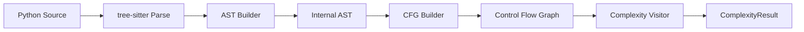
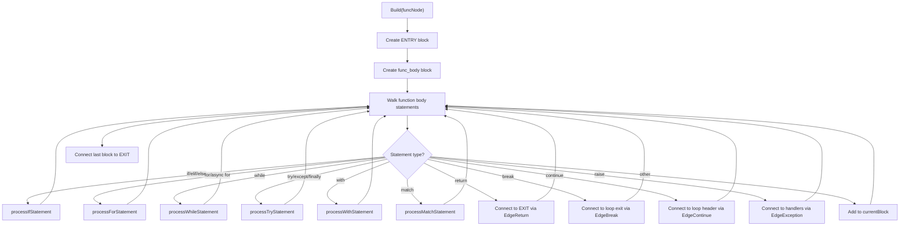
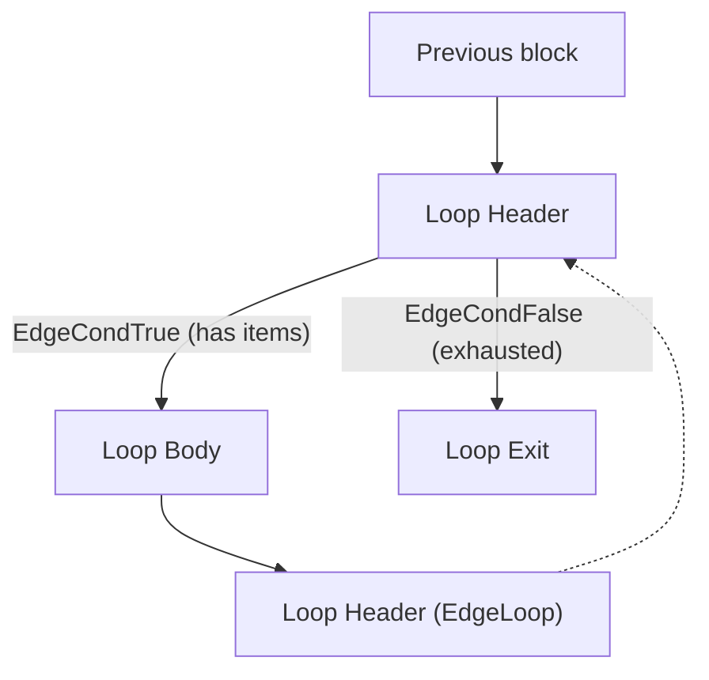

# Cyclomatic Complexity Analysis

This document describes how pyscn computes McCabe cyclomatic complexity for Python functions. The implementation spans three main phases: parsing, control-flow graph construction, and metric calculation.

## Overview

Cyclomatic complexity, introduced by Thomas J. McCabe in 1976, quantifies the number of linearly independent paths through a program's source code. A function with complexity 1 has a single straight-line path; each decision point (branch, loop, exception handler) adds one to the count.

High cyclomatic complexity correlates with code that is harder to understand, test, and maintain. pyscn uses this metric to flag functions that may benefit from refactoring.

## End-to-End Pipeline



1. **Parse** -- tree-sitter produces a concrete syntax tree (CST) from raw Python source.
2. **AST Build** -- `ASTBuilder` converts the CST into an internal `parser.Node` tree.
3. **CFG Build** -- `CFGBuilder` walks the AST and emits a per-function control flow graph.
4. **Calculate** -- `CalculateComplexity` traverses the CFG, counts decision points, and derives the final metric.

## Phase 1: Tree-sitter Python Parsing

### Parser Setup

pyscn uses the [go-tree-sitter](https://github.com/smacker/go-tree-sitter) binding with the Python grammar (`internal/parser/parser.go`):

```go
parser := sitter.NewParser()
parser.SetLanguage(python.GetLanguage())
```

Parsing is invoked via `Parser.Parse(ctx, source)`, which returns a `ParseResult` containing the tree-sitter tree, root node, source bytes, and the converted internal AST.

### AST Conversion

The `ASTBuilder` (`internal/parser/ast_builder.go`) recursively maps tree-sitter node types to internal `parser.Node` types. Each tree-sitter node type has a dedicated builder method:

| tree-sitter type | Internal NodeType | Builder method |
|---|---|---|
| `function_definition` | `FunctionDef` / `AsyncFunctionDef` | `buildFunctionDef` |
| `if_statement` | `If` | `buildIfStatement` |
| `for_statement` | `For` / `AsyncFor` | `buildForStatement` |
| `while_statement` | `While` | `buildWhileStatement` |
| `try_statement` | `Try` | `buildTryStatement` |
| `with_statement` | `With` / `AsyncWith` | `buildWithStatement` |
| `match_statement` | `Match` | `buildMatchStatement` |
| `boolean_operator` | `BoolOp` | `buildBoolOp` |
| `except_clause` | `ExceptHandler` | `buildExceptHandler` |

The internal `Node` structure (`internal/parser/ast.go`) stores typed fields for body statements, else branches, exception handlers, test conditions, and iterator expressions, making downstream CFG construction straightforward.

### Location Tracking

Every node records its source position (`Location` struct with `StartLine`, `StartCol`, `EndLine`, `EndCol`), which the complexity results carry forward to map functions back to their source locations.

## Phase 2: Control Flow Graph Construction

### Core Data Structures

The CFG (`internal/analyzer/cfg.go`) consists of:

- **BasicBlock** -- A sequence of statements with no internal branching. Each block has a unique ID, a list of `parser.Node` statements, and predecessor/successor edge lists.
- **Edge** -- A directed connection between two blocks. Each edge carries a type that describes the kind of control transfer.
- **CFG** -- Holds a map of all blocks, plus distinguished `Entry` and `Exit` blocks. Also stores the `FunctionNode` pointer for nesting depth calculation.

### Edge Types

```go
const (
    EdgeNormal    // Sequential flow
    EdgeCondTrue  // True branch of a conditional
    EdgeCondFalse // False branch of a conditional
    EdgeException // Exception flow to handler
    EdgeLoop      // Back-edge to loop header
    EdgeBreak     // Break out of loop
    EdgeContinue  // Continue to loop header
    EdgeReturn    // Return to function exit
)
```

### CFG Builder Algorithm

The `CFGBuilder` (`internal/analyzer/cfg_builder.go`) maintains:

- `currentBlock` -- the block being populated with statements
- `loopStack` -- tracks nested loops for break/continue resolution
- `exceptionStack` -- tracks nested try blocks for exception routing
- `scopeStack` -- tracks nested scopes for fully qualified naming
- `functionCFGs` -- stores separately built CFGs for nested functions and methods

#### Building Process



#### If/Elif/Else Handling

For an `if` statement, the builder:

1. Uses the current block as the condition block.
2. Creates a `then` block connected via `EdgeCondTrue`.
3. If there is an `elif`, creates a new condition block connected via `EdgeCondFalse`, then recurses.
4. If there is an `else`, creates an else block connected via `EdgeCondFalse`.
5. Creates a `merge` block where all branches converge.

Each condition test produces one decision point (one `EdgeCondTrue` + one `EdgeCondFalse` pair from the same block).

#### Loop Handling (for/while)

Loops produce a four-block pattern:



- `for` loops: the header evaluates the iterator; `EdgeCondTrue` enters the body, `EdgeCondFalse` exits.
- `while` loops: the header evaluates the condition similarly.
- Both support optional `else` clauses (executed when the loop completes normally without `break`).
- `break` connects to the loop exit block; `continue` connects to the loop header.

#### Exception Handling (try/except/finally)

The try handler creates:

1. A `try_block` connected from the current block.
2. Handler blocks for each `except` clause, connected from the try block via `EdgeException`.
3. An optional `else` block (executed if no exception occurred).
4. An optional `finally` block (always executed).
5. A `try_exit` merge block.

The `exceptionStack` tracks nesting so that `raise`, `break`, `continue`, and `return` inside try blocks properly route through `finally` blocks before reaching their destination.

#### Match Statement Handling (Python 3.10+)

Each `case` clause creates a separate block connected from the match evaluation block via `EdgeCondTrue`. A fallback `EdgeCondFalse` connects to the merge block for the no-match scenario.

#### Nested Functions and Classes

When the builder encounters a nested function or class definition, it creates a separate `CFGBuilder` instance, builds an independent CFG for that scope, and stores it in `functionCFGs`. The outer CFG simply records the definition as a statement in the current block.

`BuildAll(moduleNode)` returns all CFGs (module-level plus per-function) as a map keyed by fully qualified name.

## Phase 3: Complexity Calculation

### McCabe Formula

pyscn uses the **decision point** method:

```
Complexity = (number of decision points) + 1
```

A decision point is any CFG node that produces a branching choice. This is equivalent to the classic graph-theoretic formula `E - N + 2P` for a single connected component, but is more robust for CFGs with synthetic entry/exit nodes.

### Complexity Visitor

`CalculateComplexity` (`internal/analyzer/complexity.go`) traverses the CFG using a depth-first walk and counts:

| Counter | What it tracks |
|---|---|
| `decisionPoints` map | Unique blocks with `EdgeCondTrue`/`EdgeCondFalse` outgoing edges |
| `loopStatements` | Edges of type `EdgeLoop` |
| `exceptionHandlers` | Edges of type `EdgeException` |
| `switchCases` | Match/switch case edges |

The total decision points are computed by `countDecisionPoints`:

```go
func countDecisionPoints(visitor *complexityVisitor) int {
    conditionalDecisions := len(visitor.decisionPoints)
    return conditionalDecisions + visitor.exceptionHandlers + visitor.switchCases
}
```

The final complexity is then:

```go
complexity := decisionPoints + 1
```

The minimum complexity for any function is 1 (a function with no branching has one linear path).

### Python Syntax Elements and Their Contribution

The following table maps Python syntax to how it affects the complexity count:

| Python Construct | CFG Edges Created | Decision Points Added |
|---|---|---|
| `if` / `elif` | `EdgeCondTrue` + `EdgeCondFalse` | +1 per condition |
| `for` / `async for` | `EdgeCondTrue` + `EdgeCondFalse` + `EdgeLoop` | +1 (loop condition) |
| `while` | `EdgeCondTrue` + `EdgeCondFalse` + `EdgeLoop` | +1 (loop condition) |
| `except` clause | `EdgeException` from try block | +1 per handler |
| `match` / `case` | `EdgeCondTrue` per case | +1 per case (via switchCases counter) |
| `and` / `or` | Not directly modeled in CFG | Not counted (short-circuit not modeled) |
| `try` / `finally` | Normal + exception flow edges | 0 (structural, not a decision) |
| `with` | Normal + exception flow | 0 (structural) |
| `break` | `EdgeBreak` to loop exit | 0 (terminates path, not a decision) |
| `continue` | `EdgeContinue` to loop header | 0 (terminates path, not a decision) |
| `return` | `EdgeReturn` to function exit | 0 (terminates path) |
| `raise` | `EdgeException` to handlers/exit | 0 (terminates path) |
| Comprehension (`[x for ...]`) | Implicit loop in CFG with `EdgeCondTrue`/`EdgeCondFalse` | +1 per `for` clause; +1 per `if` filter |

**Note**: Boolean operators (`and`/`or`) introduce short-circuit evaluation in Python, but the current implementation does not model them as separate CFG branches. This is a deliberate simplification; the complexity impact of short-circuit operators is typically modest and adding CFG branches for them would inflate scores beyond standard McCabe values.

### Nesting Depth

In addition to cyclomatic complexity, pyscn calculates the maximum nesting depth for each function via `CalculateMaxNestingDepth` (`internal/analyzer/nesting_depth.go`). This traverses the AST (not the CFG) and increments depth for each nesting construct:

- `if`, `elif`, `for`, `async for`, `while`, `with`, `async with`
- `try`, `except` handler, `match`, `case`
- `lambda`, list/dict/set comprehensions, generator expressions

The `else` clause does not add nesting depth (it is at the same level as the corresponding `if`/`for`/`while`).

## Risk Level Classification

Each function receives a risk level based on configurable thresholds (`internal/config/config.go`):

| Risk Level | Complexity Range (default) | Interpretation |
|---|---|---|
| **Low** | 1 -- 9 | Simple, well-structured function. Easy to understand and test. |
| **Medium** | 10 -- 19 | Moderately complex. Consider simplification but acceptable. |
| **High** | 20+ | Highly complex. Strong candidate for refactoring. |

These thresholds are derived from McCabe's original 1976 paper and align with widely accepted industry standards.

### Configuration

Thresholds are configurable via `.pyscn.toml` or `pyproject.toml`:

```toml
[complexity]
low_threshold = 9       # Upper bound for "low" risk (inclusive)
medium_threshold = 19   # Upper bound for "medium" risk (inclusive)
enabled = true          # Enable/disable complexity analysis
report_unchanged = true # Report functions with complexity 1
max_complexity = 0      # Maximum allowed complexity (0 = no limit)
```

The `AssessRiskLevel` method determines the category:

```go
func (c *ComplexityConfig) AssessRiskLevel(complexity int) string {
    if complexity <= c.LowThreshold {
        return "low"
    } else if complexity <= c.MediumThreshold {
        return "medium"
    }
    return "high"
}
```

When `max_complexity` is set to a positive value, `ExceedsMaxComplexity` can be used as a quality gate to fail CI checks for functions exceeding the limit.

## Output

### ComplexityResult

Each analyzed function produces a `ComplexityResult` (`internal/analyzer/complexity.go`) with:

| Field | Description |
|---|---|
| `Complexity` | McCabe cyclomatic complexity value |
| `Edges` | Number of edges in the CFG |
| `Nodes` | Number of non-entry/exit blocks in the CFG |
| `ConnectedComponents` | Always 1 (single function) |
| `FunctionName` | Fully qualified function name |
| `StartLine`, `StartCol`, `EndLine` | Source location |
| `NestingDepth` | Maximum nesting depth |
| `IfStatements` | Count of conditional decision points |
| `LoopStatements` | Count of loop back-edges |
| `ExceptionHandlers` | Count of exception handler edges |
| `SwitchCases` | Count of match/case edges |
| `RiskLevel` | `"low"`, `"medium"`, or `"high"` |

### Aggregate Metrics

`CalculateAggregateComplexity` computes summary statistics across all functions in a file or project:

- Total function count
- Average, minimum, and maximum complexity
- Count of high/medium/low risk functions

### Report Formats

The `ComplexityAnalyzer` (`internal/analyzer/complexity_analyzer.go`) coordinates analysis and delegates formatting to `reporter.ComplexityReporter`, which supports JSON, YAML, CSV, and HTML output. HTML reports include interactive visualizations.

## Performance Considerations

- **Per-function CFGs**: Each function gets its own CFG built by an independent `CFGBuilder`. Nested functions are built with separate builder instances, avoiding interference with the parent scope.
- **Depth-first walk**: The CFG traversal uses a visited-set to prevent infinite loops on back-edges while counting all edges exactly once.
- **Parallel file analysis**: Multiple files are analyzed concurrently (default: 4 goroutines), with each file independently parsed, CFG-built, and scored.
- **Filtering**: `ShouldReport` filters out trivial functions (complexity = 1) when `report_unchanged` is false, reducing noise in reports for large codebases.

## Integration with Health Score

The overall project health score (`docs/ANALYZE_SCORING.md`) uses average cyclomatic complexity as one of its penalty categories. The complexity penalty is a continuous linear function:

```
penalty = min(20, max(0, (avg_complexity - 2) / 13 * 20))
```

This starts penalizing at an average complexity of 2 and reaches the maximum 20-point penalty at an average of 15.
