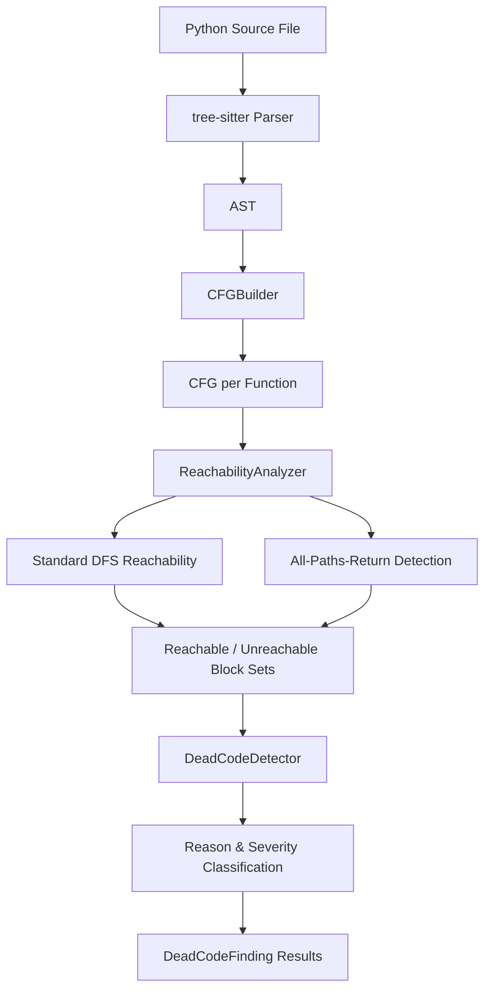
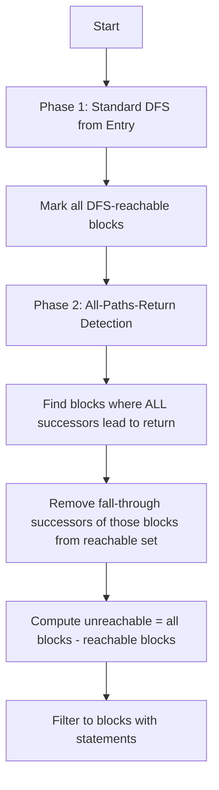

# Dead Code Detection Algorithm

This document describes the design and implementation of the dead code detection algorithm in pyscn. The core implementation resides in `internal/analyzer/dead_code.go` and `internal/analyzer/reachability.go`, with domain definitions in `domain/dead_code.go` and the service layer in `service/dead_code_service.go`.

## Overview

### What is Dead Code?

Dead code is source code that can never be executed during any possible run of a program. Common examples include statements placed after `return`, `break`, `continue`, or `raise`, and branches that can never be reached due to exhaustive control flow in preceding branches.

### Why Detection Matters

- **Code clarity**: Dead code creates confusion for developers who may try to understand or modify it, not realising it has no effect.
- **Maintenance burden**: Dead code must still be read, reviewed, and maintained alongside live code.
- **Hidden bugs**: Dead code may indicate a logic error where the developer intended the code to execute but introduced a premature terminator.
- **Code coverage noise**: Dead code inflates line counts and distorts coverage metrics, making it harder to assess true test quality.

## Analysis Architecture



The analysis executes in four stages:

1. **Parsing**: The Python source file is parsed into an AST using tree-sitter (`internal/parser`).
2. **CFG Construction**: `CFGBuilder` (`internal/analyzer/cfg_builder.go`) converts each function's AST into a Control Flow Graph (CFG) composed of `BasicBlock` nodes connected by typed edges.
3. **Reachability Analysis**: `ReachabilityAnalyzer` (`internal/analyzer/reachability.go`) determines which blocks are reachable from the entry point using DFS traversal, augmented by all-paths-return detection.
4. **Dead Code Classification**: `DeadCodeDetector` (`internal/analyzer/dead_code.go`) examines each unreachable block, determines the reason it is dead, and assigns a severity level.

## Control Flow Graph Construction

The CFG is the foundation of dead code detection. Each function is represented as a graph of `BasicBlock` nodes connected by directed `Edge` objects.

### Basic Block Structure

A `BasicBlock` (`internal/analyzer/cfg.go:63-84`) contains:
- A unique ID
- A list of AST statement nodes
- Predecessor and successor edge lists
- Entry/exit flags

### Edge Types

The CFG uses typed edges to model different control flow paths (`internal/analyzer/cfg.go:10-29`):

| Edge Type | Meaning |
|---|---|
| `EdgeNormal` | Sequential flow to the next statement |
| `EdgeCondTrue` | True branch of a conditional |
| `EdgeCondFalse` | False branch of a conditional |
| `EdgeException` | Exception handling flow |
| `EdgeLoop` | Loop back-edge |
| `EdgeBreak` | Break statement flow to loop exit |
| `EdgeContinue` | Continue statement flow to loop header |
| `EdgeReturn` | Return statement flow to function exit |

### Terminator Handling in the CFG Builder

When the CFG builder encounters a terminator statement (`return`, `break`, `continue`, `raise`), it performs two actions:

1. **Connects the current block** to the appropriate target (exit block, loop exit, loop header, or exception handler) via a typed edge.
2. **Creates a new "unreachable" block** and sets it as the current block. Any subsequent statements in the same scope are added to this disconnected block.

This design ensures that code after a terminator is structurally isolated in the CFG, making it detectable by reachability analysis.

For example, when processing a `return` statement (`internal/analyzer/cfg_builder.go:323-367`):

```
currentBlock --[EdgeReturn]--> CFG.Exit
currentBlock = new unreachable block (disconnected)
```

## Detection Patterns

### Pattern 1: Unreachable Code After Return

Code placed after a `return` statement within the same block or scope.

```python
def calculate(x):
    result = x * 2
    return result
    print("This never executes")   # CRITICAL: unreachable_after_return
    cleanup()                       # CRITICAL: unreachable_after_return
```

**Detection mechanism**: The CFG builder connects the block containing `return` directly to the exit block via an `EdgeReturn` edge. It then creates a new "unreachable" block for any following statements. Since this block has no incoming edges from reachable blocks, the reachability analyzer marks it as unreachable.

### Pattern 2: Unreachable Code After Break

Code placed after a `break` statement inside a loop.

```python
def search(items):
    for item in items:
        if item.matches():
            break
            log("found")            # CRITICAL: unreachable_after_break
        process(item)               # Reachable (only when condition is false)
    return items
```

**Detection mechanism**: The CFG builder connects the block containing `break` to the loop's exit block via an `EdgeBreak` edge, then creates an unreachable block for subsequent statements (`internal/analyzer/cfg_builder.go:817-858`).

### Pattern 3: Unreachable Code After Continue

Code placed after a `continue` statement inside a loop.

```python
def filter_items(items):
    for i in range(10):
        if i > 5:
            continue
            x = 1                   # CRITICAL: unreachable_after_continue
        process(i)                  # Reachable (only when condition is false)
```

**Detection mechanism**: The CFG builder connects the block containing `continue` to the loop's header block via an `EdgeContinue` edge, then creates an unreachable block (`internal/analyzer/cfg_builder.go:860-901`).

### Pattern 4: Unreachable Code After Raise

Code placed after a `raise` statement.

```python
def validate(x):
    if x < 0:
        raise ValueError("negative")
        log("error raised")        # CRITICAL: unreachable_after_raise
    return x
```

**Detection mechanism**: The CFG builder connects the block containing `raise` to exception handlers (if inside a `try` block) or to the exit block, then creates an unreachable block (`internal/analyzer/cfg_builder.go:1120-1163`).

### Pattern 5: Unreachable Code After Exhaustive Branches

When all branches of an `if/elif/else` chain contain terminators (return, raise, break, continue), any code after the entire conditional is unreachable.

```python
def classify(x):
    if x > 0:
        return "positive"
    elif x < 0:
        return "negative"
    else:
        return "zero"
    print("unreachable")            # WARNING: unreachable_branch
```

**Detection mechanism**: The CFG builder's `allBranchesTerminate()` method (`internal/analyzer/cfg_builder.go:1466-1475`) checks whether both the then-branch and else-branch end with terminator statements. If they do, the merge block is replaced with an unreachable block, and subsequent code flows into it without any reachable predecessor.

This also works with nested exhaustive returns:

```python
def nested(x, y):
    if x > 0:
        if y > 0:
            return "both positive"
        else:
            return "x positive, y not"
    else:
        return "x not positive"
    print("unreachable")            # WARNING: unreachable_branch
```

### Pattern 6: Unreachable Code in Exception Handling

Dead code within `try/except/finally` blocks.

```python
def risky():
    try:
        x = 1
        return x
        raise ValueError()         # CRITICAL: unreachable_after_return
    except ValueError:
        y = 2                       # Reachable (conservative analysis)
    finally:
        cleanup()                   # Always reachable
```

**Detection mechanism**: Exception handlers are conservatively considered reachable because an exception could be raised at any point before the return statement. The `finally` block is always treated as reachable. However, code after a `return` or `raise` within the same `try` body is correctly detected as dead.

## Reachability Analysis

The `ReachabilityAnalyzer` (`internal/analyzer/reachability.go`) determines which blocks in the CFG are reachable from the entry point.

### Algorithm

The analysis uses a two-phase approach (`internal/analyzer/reachability.go:188-205`):



#### Phase 1: Standard DFS Reachability

A depth-first traversal starting from the CFG entry block. Each visited block is marked as reachable. The traversal follows all successor edges.

```go
// Walk performs a depth-first traversal of the CFG (cfg.go:268-276)
func (cfg *CFG) Walk(visitor CFGVisitor) {
    visited := make(map[string]bool)
    cfg.walkBlock(cfg.Entry, visitor, visited)
}
```

#### Phase 2: All-Paths-Return Detection

This phase handles a subtle case: when all branches of a conditional return, the code after the conditional is unreachable even though the CFG may have structural edges connecting it.

The `allSuccessorsReturn()` method (`internal/analyzer/reachability.go:228-283`) recursively checks whether every execution path from a given block leads to a `return` statement. It uses:
- **Memoization** (`allPathsReturnCache`): Caches results to avoid redundant computation.
- **Cycle detection** (`visited` map): Prevents infinite recursion on loops.

```go
func (ra *ReachabilityAnalyzer) allSuccessorsReturn(block *BasicBlock, visited map[string]bool) bool {
    // Base cases: contains return -> true; exit block -> false; no successors -> false
    // Recursive: ALL successors must lead to returns
}
```

When a block is identified as an all-paths-return block, its normal-edge successors are removed from the reachable set (`internal/analyzer/reachability.go:286-305`).

### Unreachable Block Filtering

After reachability analysis, only unreachable blocks that contain statements are reported (`internal/analyzer/reachability.go:140-150`). Empty blocks (structural nodes like merge points) are excluded to avoid false positives.

## Dead Code Reason Classification

The `DeadCodeDetector.determineDeadCodeReason()` method (`internal/analyzer/dead_code.go:219-231`) determines why a block is dead by examining its context in the CFG.

### Classification Logic

The detector uses a two-step approach (`internal/analyzer/dead_code.go:234-298`):

1. **Source proximity check**: For each unreachable block, scan all other blocks in the CFG. If a block ending within 5 lines before the unreachable block contains a terminator statement, classify accordingly.

2. **CFG edge check**: Examine the predecessor edges of the unreachable block. If a predecessor contains a terminator and is sequentially before the unreachable block (verified by line numbers and edge types), classify accordingly.

The classification priority is:
1. `unreachable_after_return` -- predecessor contains `return`
2. `unreachable_after_break` -- predecessor contains `break`
3. `unreachable_after_continue` -- predecessor contains `continue`
4. `unreachable_after_raise` -- predecessor contains `raise`
5. `unreachable_branch` -- default for blocks unreachable due to exhaustive branching
6. `unreachable_after_infinite_loop` -- code after an infinite loop

| Reason | Description |
|---|---|
| `unreachable_after_return` | Code appears after a `return` statement |
| `unreachable_after_break` | Code appears after a `break` statement |
| `unreachable_after_continue` | Code appears after a `continue` statement |
| `unreachable_after_raise` | Code appears after a `raise` statement |
| `unreachable_branch` | Code in a branch unreachable under normal execution flow |
| `unreachable_after_infinite_loop` | Code appears after an infinite loop |

## Severity Classification

Each finding is assigned a severity level based on the confidence of the detection.

| Severity | Numeric Level | Criteria | Meaning |
|---|---|---|---|
| **Critical** | 3 | Code directly after a terminator (`return`, `break`, `continue`, `raise`) in the same scope | Definitely unreachable; almost certainly a bug or leftover code |
| **Warning** | 2 | Unreachable branches due to exhaustive control flow (default severity) | Likely unreachable; may indicate a logic issue |
| **Info** | 1 | Potential optimization opportunities | May be intentional or context-dependent |

### Severity Assignment Rules

From `internal/analyzer/dead_code.go:219-231`:

- If a terminator (`return`, `break`, `continue`, `raise`) is found in a preceding block: **Critical**
- If no specific terminator is identified (e.g., unreachable due to exhaustive branching): **Warning** (default)

### Severity Filtering

Results can be filtered by minimum severity (`domain/dead_code.go:41`). The default minimum severity is `Warning`, which excludes `Info`-level findings.

```go
// Default configuration (domain/dead_code.go:226)
MinSeverity: DeadCodeSeverityWarning,
```

The `FilterFindingsBySeverity()` function (`internal/analyzer/dead_code.go:511-528`) uses a numeric ordering to filter:
- Info = 1, Warning = 2, Critical = 3

## False Positive Avoidance

### Conservative Exception Handling

Exception handlers (`except` blocks) are always treated as reachable, even if the `try` body contains a `return` before any potentially-raising statement. This is because in Python, exceptions can be raised at almost any point:

```python
def foo():
    try:
        return 1
    except ValueError:
        x = 2   # Conservatively considered reachable
```

This conservative approach is implemented by the CFG builder connecting the `try` block to all exception handlers via `EdgeException` edges (`internal/analyzer/cfg_builder.go:974-977`).

### Finally Block Always Reachable

`finally` blocks are always treated as reachable because Python guarantees their execution regardless of how the `try` block exits (`internal/analyzer/cfg_builder.go:1026-1038`).

### No Constant Folding

The analyzer does not perform constant folding or value tracking. An `if False:` branch is not detected as dead code because the analyzer does not evaluate conditions:

```python
def foo():
    if False:
        x = 1   # NOT flagged (no constant evaluation)
    else:
        y = 2   # Reachable
```

This is intentional: constant-based dead branches are better handled by linters that perform value analysis. pyscn focuses on structural unreachability from the control flow graph.

### Module-Level Code Skipped

The `__main__` module-level CFG is excluded from dead code analysis (`internal/analyzer/dead_code.go:169`). Only function-level CFGs are analysed, which avoids false positives from module-level code patterns like guard clauses.

### Empty Blocks Excluded

Unreachable blocks with no statements are excluded from results (`internal/analyzer/reachability.go:140-150`). These are structural artifacts of the CFG (merge nodes, empty exit blocks) and do not correspond to actual dead code.

### Sequential Proximity Heuristic

The `isSequentiallyAfter()` method (`internal/analyzer/dead_code.go:343-373`) uses a line-number gap threshold of 10 lines to determine whether an unreachable block is "directly after" a terminator block. This avoids misclassifying structurally distant blocks that happen to be unreachable for other reasons.

## Concrete Examples

### Example 1: Multiple Returns with Dead Code

```python
def classify(x):
    if x > 0:
        return 1
        dead1 = True    # CRITICAL: unreachable_after_return (line 4)
    if x < 0:
        return -1
        dead2 = True    # CRITICAL: unreachable_after_return (line 7)
    return 0
    dead3 = True        # CRITICAL: unreachable_after_return (line 9)
```

This produces 3 findings, all at Critical severity.

### Example 2: Complex Loop with Mixed Terminators

```python
def complex():
    try:
        for i in range(10):
            if i > 5:
                break
                x = 1           # CRITICAL: unreachable_after_break
            elif i < 0:
                return -1
                y = 2           # CRITICAL: unreachable_after_return
            else:
                continue
                z = 3           # CRITICAL: unreachable_after_continue
        return 0
        unreachable = True      # CRITICAL: unreachable_after_return
    except:
        pass
    finally:
        cleanup = True          # Reachable (finally always executes)
```

This produces 4 findings, all at Critical severity.

### Example 3: Exhaustive If/Elif/Else

```python
def sign(x):
    if x > 0:
        return "positive"
    elif x < 0:
        raise ValueError("negative")
    else:
        return "zero"
    print("unreachable")        # WARNING: unreachable_branch
```

The print statement receives Warning severity because the unreachability is inferred from exhaustive branch analysis rather than a direct terminator predecessor.

## Health Score Integration

In the `pyscn analyze` command's overall health score calculation, dead code contributes as the **Dead Code** category with a maximum penalty of 20 points.

### Penalty Calculation

```
weightedDeadCode = (CriticalFindings * 1.0) + (WarningFindings * 0.5) + (InfoFindings * 0.2)
normalizationFactor = log10(max(1, totalFiles / 10))
penalty = min(20, weightedDeadCode / normalizationFactor)
```

- Critical findings have a weight of 1.0
- Warning findings have a weight of 0.5
- Info findings have a weight of 0.2
- The normalization factor scales with project size to avoid penalising large projects unfairly

See [Analyze Scoring Reference](../ANALYZE_SCORING.md) for the complete scoring breakdown.

## Configuration

### Detection Toggles

Each detection pattern can be individually enabled or disabled (`domain/dead_code.go:54-58`):

| Option | Default | Description |
|---|---|---|
| `detect_after_return` | true | Detect unreachable code after `return` |
| `detect_after_break` | true | Detect unreachable code after `break` |
| `detect_after_continue` | true | Detect unreachable code after `continue` |
| `detect_after_raise` | true | Detect unreachable code after `raise` |
| `detect_unreachable_branches` | true | Detect unreachable branches in conditionals |

### Output Options

| Option | Default | Description |
|---|---|---|
| `--min-severity` | warning | Minimum severity to report (info, warning, critical) |
| `--sort-by` | severity | Sort criteria (severity, line, file, function) |
| `--show-context` | false | Show surrounding code context |
| `--context-lines` | 3 | Number of context lines to display |
| `--format` | text | Output format (text, json, yaml, csv, html) |

### Configuration File (.pyscn.toml)

```toml
[deadcode]
min_severity = "warning"
sort_by = "severity"
detect_after_return = true
detect_after_break = true
detect_after_continue = true
detect_after_raise = true
detect_unreachable_branches = true
```

Configuration priority: Command-line flags > Configuration file > Default values

## Output Formats

| Format | Use Case |
|---|---|
| `text` | Human-readable CLI output (default) |
| `json` | Programmatic consumption |
| `yaml` | Configuration file compatibility |
| `csv` | Spreadsheet analysis |
| `html` | Interactive report (auto-opens in browser) |

For each finding, the following information is included:
- File path and line range
- Function name
- Dead code snippet
- Reason and severity
- Human-readable description

## Implementation Notes

### Performance Characteristics

- CFG construction is linear in the number of AST nodes.
- DFS reachability is O(V + E) where V = blocks and E = edges.
- All-paths-return detection uses memoization to avoid exponential traversal of branching structures.
- The `findTerminatorInPredecessors` method has O(B) complexity per unreachable block, where B is the total number of blocks in the CFG.

### Parallel File Processing

The service layer processes multiple files independently. Each file undergoes parsing, CFG construction, and dead code analysis. Errors in one file do not stop processing of others (`service/dead_code_service.go:35-60`).

### Summary Metrics

The analysis produces aggregate metrics at file and project levels:
- `TotalBlocks` / `DeadBlocks`: Raw block counts
- `ReachableRatio`: Proportion of reachable blocks
- `DeadCodeRatio`: Proportion of dead blocks per file
- `FindingsByReason`: Distribution of findings by reason category

## Related Documentation

- [Analyze Scoring Reference](../ANALYZE_SCORING.md) -- Position of the dead code penalty within the overall health score
- [CBO Algorithm](cbo.md) -- Companion algorithm documentation
