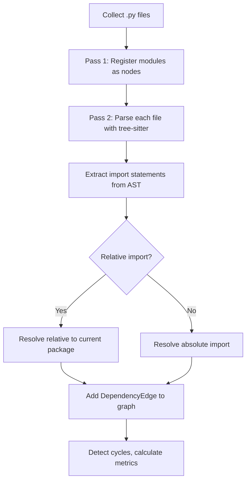
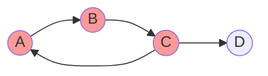
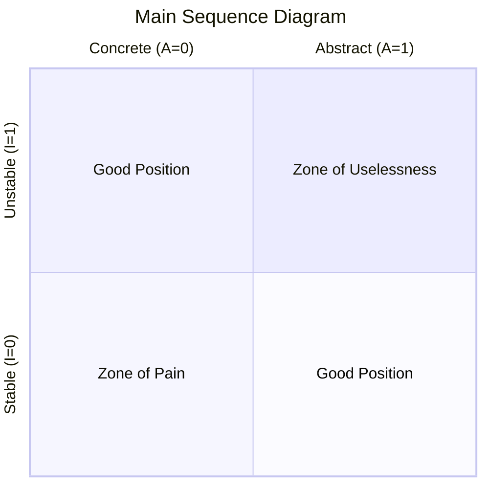
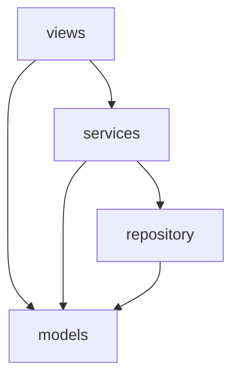

# Dependency Analysis

This document describes the algorithms and data structures behind pyscn's module dependency analysis. The implementation lives primarily in `internal/analyzer/dependency_graph.go`, `internal/analyzer/module_analyzer.go`, `internal/analyzer/circular_detector.go`, and `internal/analyzer/coupling_metrics.go`, with domain types defined in `domain/system_analysis.go`.

## Overview

Dependency analysis examines the `import` relationships between Python modules in a project. It answers questions such as:

- Which modules depend on which other modules?
- Are there circular dependency chains that make the code hard to maintain?
- How deep is the dependency tree?
- Are modules well-positioned on Robert C. Martin's Main Sequence?

Understanding these relationships is critical for maintaining a healthy codebase. Excessive coupling, deep dependency chains, and circular imports all increase the cost of change and the risk of introducing bugs.

## Module Dependency Graph Construction

### Data Model

The dependency graph is a directed graph where:

- **Nodes** are Python modules (each `.py` file maps to one node).
- **Edges** are import relationships between modules.

Each `ModuleNode` tracks:

| Field | Description |
|---|---|
| `Name` | Dotted module name, e.g. `mypackage.submodule` |
| `FilePath` | Absolute path to the `.py` file |
| `Package` | Top-level package extracted from the module name |
| `IsPackage` | `true` if the file is `__init__.py` |
| `InDegree` | Number of modules that import this module (fan-in) |
| `OutDegree` | Number of modules this module imports (fan-out) |
| `Dependencies` | Set of outgoing module names |
| `Dependents` | Set of incoming module names |

Edges carry a `DependencyEdgeType`:

| Type | Python syntax | Example |
|---|---|---|
| `import` | `import module` | `import os` |
| `from_import` | `from module import name` | `from utils import helper` |
| `relative` | `from .module import name` | `from .models import User` |
| `implicit` | Indirect dependency | -- |

### Two-Pass Construction

Graph construction proceeds in two passes (see `ModuleAnalyzer.AnalyzeProject`):

```
Pass 1 -- Register all modules
  For each .py file matching include patterns and not matching exclude patterns:
    Convert file path to dotted module name
    Add a ModuleNode to the graph

Pass 2 -- Resolve imports and add edges
  For each .py file:
    Parse file with tree-sitter
    Extract import statements from the AST
    Resolve each import to a target module name
    Add a DependencyEdge to the graph
```



### Import Resolution

#### Absolute Imports

For `import foo.bar` or `from foo.bar import Baz`, the analyzer searches in priority order:

1. **Current file directory** -- check for `foo/bar.py` or `foo/bar/__init__.py`
2. **Project root** -- same check relative to the project root
3. **Parent directory** -- one level up
4. **Python path entries** -- additional search paths provided in configuration
5. **Standard library check** -- matches against a known set of stdlib module names (e.g. `os`, `sys`, `typing`)
6. **Third-party fallback** -- if `includeThirdParty` is enabled, unresolved names are included as-is

Results are cached in `resolvedModules` to avoid repeated filesystem lookups.

#### Relative Imports

For `from .models import User` or `from ..utils import helper`:

1. The **level** (number of leading dots) determines how many directory levels to ascend from the current file.
2. The remaining module name (after the dots) is appended to the resolved parent directory.
3. The result is converted back to a dotted module name.

```python
# In mypackage/sub/views.py:
from .models import User       # Level 1 -> mypackage.sub.models
from ..utils import helper     # Level 2 -> mypackage.utils
```

#### Re-Export Resolution

Python packages commonly re-export names in `__init__.py`:

```python
# mypackage/__init__.py
from .module_a import ClassA
from .module_b import ClassB
```

When another module does `from mypackage import ClassA`, a naive analysis would record a dependency on `mypackage` rather than `mypackage.module_a`. The `ReExportResolver` fixes this by:

1. Parsing the target package's `__init__.py` with tree-sitter
2. Building a map of exported name to actual source module
3. Respecting `__all__` declarations when present (filtering to only declared exports)
4. Caching results per package to avoid repeated parsing
5. Resolving each imported name independently -- different names may come from different source modules

#### TYPE_CHECKING Exclusion

Imports guarded by `if TYPE_CHECKING:` blocks are excluded from dependency edges. These imports exist only for static type checkers and do not create runtime dependencies, so including them would produce false circular dependency reports. The analyzer walks up the AST parent chain to detect this pattern, handling both `TYPE_CHECKING` and `typing.TYPE_CHECKING` forms.

#### __init__.py Self-Import Filtering

When an `__init__.py` file imports from its own submodules (a standard Python re-export pattern), those edges are filtered out. Without this, every package would appear to have a dependency on all of its own submodules, inflating coupling numbers.

## Cycle Detection Algorithm

### Tarjan's Strongly Connected Components

Circular dependency detection uses **Tarjan's algorithm** to find all strongly connected components (SCCs) in the dependency graph. An SCC with more than one node represents a circular dependency.

The algorithm runs in O(V + E) time where V is the number of modules and E is the number of edges.

```
function strongConnect(module):
    index[module] = lowLink[module] = currentIndex++
    push module onto stack
    inStack[module] = true

    for each dependency of module:
        if dependency not visited:
            strongConnect(dependency)
            lowLink[module] = min(lowLink[module], lowLink[dependency])
        else if dependency in stack:
            lowLink[module] = min(lowLink[module], index[dependency])

    if lowLink[module] == index[module]:
        // module is root of an SCC
        pop all nodes from stack until module is popped
        if component has more than 1 node:
            record as circular dependency
```



In this example, {A, B, C} form a strongly connected component (cycle), while D does not participate.

### Cycle Severity Assessment

Each detected cycle is assigned a severity based on its size and the importance of involved modules:

| Severity | Condition |
|---|---|
| **Critical** | 10+ modules in the cycle, OR any module has fan-in > 10 (core infrastructure) |
| **High** | 6--9 modules |
| **Medium** | 3--5 modules |
| **Low** | 2 modules (simple mutual dependency) |

### Dependency Chain Analysis within Cycles

For each SCC, the analyzer finds the actual dependency chains between modules using BFS. This produces human-readable paths like `A -> B -> C -> A` that explain exactly how the cycle forms.

### Cycle-Breaking Suggestions

The system generates actionable refactoring suggestions:

- **Largest cycle**: Extract common functionality into a separate module
- **Core infrastructure modules** (appearing in multiple cycles): Refactor to reduce coupling
- **Critical cycles**: Apply Dependency Inversion Principle
- **Simple two-module cycles**: Introduce a third module or use dependency injection

## Dependency Depth Analysis

Dependency depth measures the length of the longest chain of transitive dependencies starting from any module.

### Calculation

The algorithm performs a recursive DFS from each root module (modules with `OutDegree == 0`), tracking the maximum depth reached. Cycles are handled by maintaining a visited set to prevent infinite recursion.

```
function findMaxDepthFrom(module, visited):
    if module in visited: return 0
    visited.add(module)

    maxChildDepth = 0
    for each dependency of module:
        childDepth = findMaxDepthFrom(dependency, visited)
        maxChildDepth = max(maxChildDepth, childDepth)

    visited.remove(module)
    return maxChildDepth + 1
```

### Expected Depth

The expected maximum depth for a well-structured project of N modules is approximately:

```
expected = max(3, ceil(log2(N + 1)) + 1)
```

Exceeding this threshold suggests that the dependency chain is deeper than necessary, which can indicate poor layering or excessive transitive coupling.

## Robert C. Martin's Package Metrics

The coupling metrics calculator (`CouplingMetricsCalculator`) computes metrics from Robert C. Martin's package design principles for each module.

### Afferent Coupling (Ca)

**Ca** = number of modules that depend on this module (i.e., `InDegree`).

High Ca means many other modules will break if this module changes. Such modules should be stable and well-tested.

### Efferent Coupling (Ce)

**Ce** = number of modules this module depends on (i.e., `OutDegree`).

High Ce means this module is sensitive to changes in many other modules.

### Instability (I)

```
I = Ce / (Ca + Ce)
```

| Value | Meaning |
|---|---|
| I = 0 | Maximally stable -- only depended upon, depends on nothing |
| I = 1 | Maximally unstable -- depends on others, nobody depends on it |

If `Ca + Ce = 0` (isolated module), instability defaults to 0.

### Abstractness (A)

Abstractness measures the ratio of "abstract" public names to total public names in a module. A name is considered abstract if it matches one of these heuristics:

- Ends with `Interface`, `Abstract`, `Base`, or `ABC`
- Starts with `I` followed by an uppercase letter (e.g., `IRepository`)

```
A = abstract_public_names / total_public_names
```

A value of 0 means entirely concrete; 1 means entirely abstract.

### Distance from Main Sequence (D)

The **Main Sequence** is the ideal line where `A + I = 1`. Modules on this line have the right balance of abstractness and stability.

```
D = |A + I - 1|
```



| Zone | Position | Problem |
|---|---|---|
| **Zone of Pain** | Low A, Low I (concrete + stable) | Hard to change because many modules depend on concrete implementations |
| **Zone of Uselessness** | High A, High I (abstract + unstable) | Abstract modules that nobody uses |
| **Main Sequence** | D close to 0 | Well-balanced -- abstractness matches stability |

### Risk Level Assignment

Based on the Distance metric, each module is assigned a risk level:

| Distance (D) | Risk Level |
|---|---|
| D > 0.7 | High |
| D > 0.4 | Medium |
| D <= 0.4 | Low |

## System-Wide Metrics

The `SystemMetrics` struct aggregates module-level metrics into project-wide indicators:

| Metric | Formula | Description |
|---|---|---|
| Average Fan-In | sum(Ca) / N | Average number of incoming dependencies |
| Average Fan-Out | sum(Ce) / N | Average number of outgoing dependencies |
| Dependency Ratio | Total Edges / N | Average dependencies per module |
| Average Instability | sum(I) / N | System-wide average instability |
| Average Abstractness | sum(A) / N | System-wide average abstractness |
| Main Sequence Deviation | sum(D) / N | Average distance from main sequence |
| Cyclic Dependencies | count of modules in SCCs | Number of modules involved in cycles |
| Max Dependency Depth | longest chain length | Maximum transitive dependency depth |

### Modularity Index

The modularity index measures how well the system is decomposed into packages:

```
cohesionRatio = intra_package_edges / total_edges
cyclePenalty  = 1.0 - (cyclic_modules / total_modules * 0.5)

ModularityIndex = cohesionRatio * cyclePenalty
```

A modularity index close to 1.0 indicates high intra-package cohesion with low inter-package coupling and few cycles. A single-package system defaults to 0.5.

### System Complexity

System complexity is a composite score combining:

```
structural = 0.4 * log2(1 + edges/modules)
size       = 0.3 * log2(1 + modules)
coupling   = 0.3 * sqrt(variance(instability)) * 10

SystemComplexity = structural + size + coupling
```

### Refactoring Priorities

Modules are ranked for refactoring priority based on:

| Factor | Weight |
|---|---|
| Distance from Main Sequence > 0.5 | D * 50 points |
| Module is in a dependency cycle | +30 points |
| Cyclomatic complexity > 20 | (complexity - 20) * 2 points |

Only modules scoring above 10 points are included. The top 10 are reported.

## Health Score Integration

Dependency analysis contributes up to **16 points** of penalty to the overall health score (out of 100). The penalty is split into three components:

| Component | Max Penalty | Formula |
|---|---|---|
| Circular dependencies | 10 | `10 * (modules_in_cycles / total_modules)` |
| Excessive depth | 3 | `min(3, max_depth - expected_depth)` where `expected = max(3, ceil(log2(N+1)) + 1)` |
| Main Sequence Deviation | 3 | `round(avg_MSD * 3)` where MSD is clamped to [0, 1] |

When dependency analysis is disabled (`--skip-deps`), the penalty is zero and does not affect the health score.

## Concrete Example

Consider a small project with four modules:

```
myapp/
  __init__.py
  models.py      # defines User, Order
  services.py    # from .models import User; from .repository import UserRepo
  repository.py  # from .models import User
  views.py       # from .services import UserService; from .models import Order
```

### Dependency Graph



### Computed Metrics

| Module | Ca | Ce | I | A | D | Risk |
|---|---|---|---|---|---|---|
| models | 3 | 0 | 0.00 | 0.0 | 1.00 | High |
| repository | 1 | 1 | 0.50 | 0.0 | 0.50 | Medium |
| services | 1 | 2 | 0.67 | 0.0 | 0.33 | Low |
| views | 0 | 2 | 1.00 | 0.0 | 0.00 | Low |

- **models** sits in the Zone of Pain (D=1.0): it is maximally stable (everything depends on it) but entirely concrete. Introducing abstract base classes or protocols would improve this.
- **views** is maximally unstable (I=1.0) with D=0.0 -- perfectly positioned as a top-level consumer.
- **No cycles** exist, so the cycle penalty is 0.
- **Max depth** is 3 (views -> services -> repository -> models).

### Health Score Impact

With 4 modules and no cycles:

- Cycle penalty: `10 * 0/4 = 0`
- Expected depth: `max(3, ceil(log2(5)) + 1) = max(3, 4) = 4`; actual depth = 3, so excess = 0
- MSD penalty: `round(avg(1.0, 0.5, 0.33, 0.0) * 3) = round(0.46 * 3) = round(1.37) = 1`
- **Total dependency penalty: 1 out of 16**

## Key Source Files

| File | Purpose |
|---|---|
| `internal/analyzer/dependency_graph.go` | Graph data structures (`DependencyGraph`, `ModuleNode`, `DependencyEdge`) |
| `internal/analyzer/module_analyzer.go` | Import parsing, resolution, and graph construction |
| `internal/analyzer/circular_detector.go` | Tarjan's SCC algorithm and cycle analysis |
| `internal/analyzer/coupling_metrics.go` | Robert C. Martin's metrics and system-wide calculations |
| `internal/analyzer/reexport_resolver.go` | Re-export resolution for `__init__.py` files |
| `domain/system_analysis.go` | Domain types for analysis results |
| `domain/analyze.go` | Health score dependency penalty calculation |
| `service/system_analysis_service.go` | Service orchestration -- builds graph, runs detectors, assembles results |
